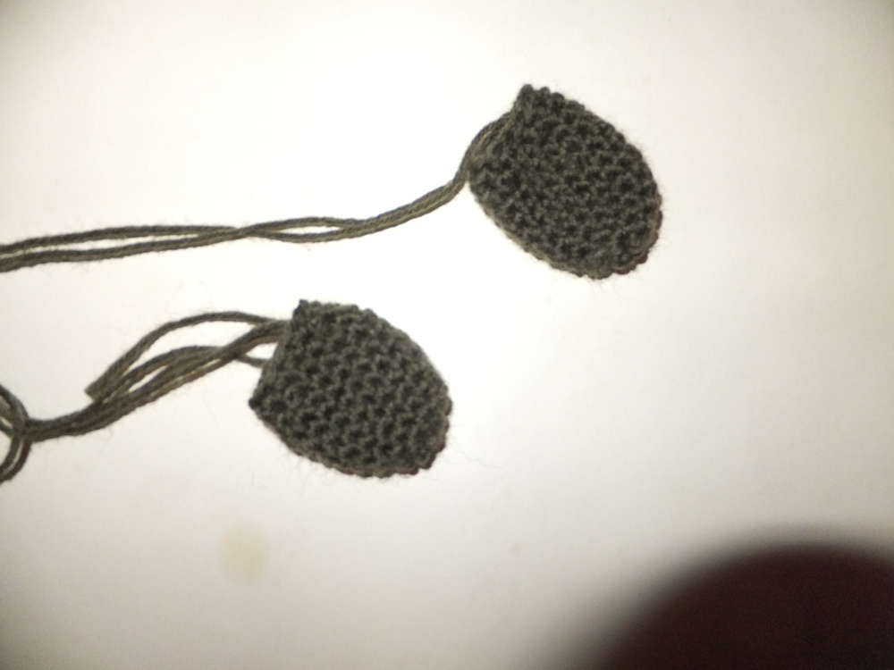

Ich habe vor langer Zeit mal eine Anleitung zum Häkeln eines Drachens
gesucht und gefunden, der Drache war mir jedoch zu klein und so habe ich
ihn vergrößert und einige Details hinzugefügt. Tatsächlich habe ich die
detaillierte Anleitung aber zunächst kein Foto gehabt. Aber den Ferien
sei Dank, ich hab mich die letzten Tage mal hingesetzt und den Drachen
erneut gehäkelt. Hier ist jetzt endlich die bebilderte Anleitung meines
Amigurumidrachens.
 
M=Masche/n 
fM=feste Masche/n 
KM=Kettmasche 
LM=Luftmasche

## Kopf 
1. 2LM, in die 1.LM 6fM 
2. M verd. =12M 
3. Jede 2.M verd.=18M 
4. 18fM 
5. 18fM 
6. 18fM 
7. 18fM 
8. Die ersten 5M verd., fM in restl. M =23M 
9. 23fM 
10. Jede 2. M innerh. der ersten 10M verd. =27M (über der vorhergehenden Zunahme in Reihe8) 
11. 27fM 
12. 27fM 
13. 27fM 
14. 2M zus., 5fM, wiederh. =23M 
15. 2M zus., 3fM, wiederh. =18M, mit Watte füllen 
16. 2M zus., 1fM, wiederh., KM+ Faden durchz. =12M
17. 2M zus., 1fM, wiederh., KM+ Faden durchz. =8M

## Körper
1. 2LM, in die 1.LM 4fM 
2. M verd. =8M 
3. Jede 2.M verd. =12M 
4. 12fM
5. Jede 2.M verd.=18M 
6. 18fM 
7. 18fM 
8. 18fM 
9. 18fM 
10. Jede 3.M verd. =24M 
11. 24fM 
12. Jede 4.M verd. =30M 
13. 30fM 
14. Jede 5.M verd. =36M 
15. 36fM 
16. Jede 6.M verd. =42M 
17. 42fM 
18. 42fM 
19. 42fM 
20. 42fM 
21. 42fM 
22. 42fM 
23. 2M zus., 5fM, wiederh. =36M 
24. 36fM 
25. 2M zus., 4fM, wiederh. =30M 
26. 30fM 
27. 2M zus., 3fM, wiederh. =24M 
28. 24fM 
29. 2M zus., 2fM, wiederh. =18M, mit Watte füllen 
30. 2M zus. bis das Loch geschl. ist, KM+ Faden durchz.

## Schwanz
​1. 2LM, in die 1.LM 3fM 
2. M verd. =6M 
3. 6fM 
4. Jede 2.M verd.=9M 
5. 9fM 
6. Jede 3.M verd.=12M 
7. 12fM 
8. Jede 4.M verd. =15M 
9. 15fM …
wiederh. bis 42fM, KM+ Faden durchz.

## Augenlider 2x
1. 2LM, in die 1.LM 6fM
2. M verd. bis 12M, KM

## Ohren 2x
1. 2LM, in die 1.LM 4fM
2. Jede 2.M verd. =6M
3. Jede 3.M verd. =8M
4. Jede 4.M verd. =10M
5. Jede 5.M verd. =12M
6. 12fM, KM+ Faden durchz.
7. 12fM, KM+ Faden durchz.
8. 12fM, KM+ Faden durchz.
Ohren unten zusammenraffen und vernähen

## Arme 2x
1. 2LM, in die 1.LM 4fM
2. M verd. =8M
3. Jede 2.M verd. =12M
4. 12fM,
5. 12fM,
6. 12fM,
7. 12fM,
8. 12fM,
9. 12fM,
10. 12fM,
11. 12fM,
12. 12fM,
13. 12fM,
14. KM+ Faden durchz.

## Beine 2x
1. 2LM, in die 1.LM 6fM
2. M ver. =12M
3  12fM
4. Jede 3.M verd. =16M
5. 16fM
6. 16fM
7. 16fM
8. 16fM
9. 16fM
10. Jede 3.M zus. =12M
11. 12fM, KM+ Faden durchz.

## Flügel 2x
Stege: 21LM, 15fM, 11LM, 10fM, 11LM, 10fM

Die Flügelmembranen sind improvisiert und sehen jedes Mal anders aus. Ich habe schon überlegt beim nächsten mal ein Spitzenmuster von einem Häkeldeckchen zu nehmen.

## Stachelkamm
Ich habe den Zackenkamm auf verschiedenste Weisen gehäkelt,man kann einfach eine Reihe fM häkeln und dann immer abwechselnd fM und 2 Stäbchen oder man kann direkt in einem Rutsch KM, fM, Stäbchen, fM, KM; oder man denkt sich einfach was eigenes aus.
So sieht mein Drachenbaby aus.

Den großen Drachen habe ich auf Wunsch einer Freundin gehäkelt, er soll ein Geschenk für ihre Mama sein.

Viel Spass eure Ermeline, ich freue mich über Drachenbabyfotos.

Eines habe ich von Svenja bekommen, sie hat gerade erst mit dem Häkeln begonnen, ist der Drache nicht richtig toll geworden?

