Schon lange wollte ich eine Art Seelenwärmer haben und dann fand ich zufällig ein Bild von einem Schal mit Ärmeln. Ohne zu wissen wieviel Wolle ich brauchte und wieviele Maschen ich aufnehmen muss legte ich los und entschied mich für zwei einfache Muster, die sich abwechseln sollten. 
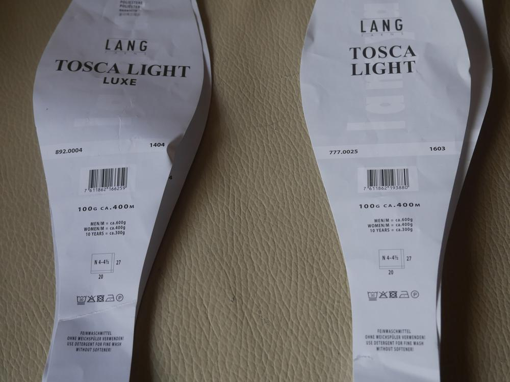
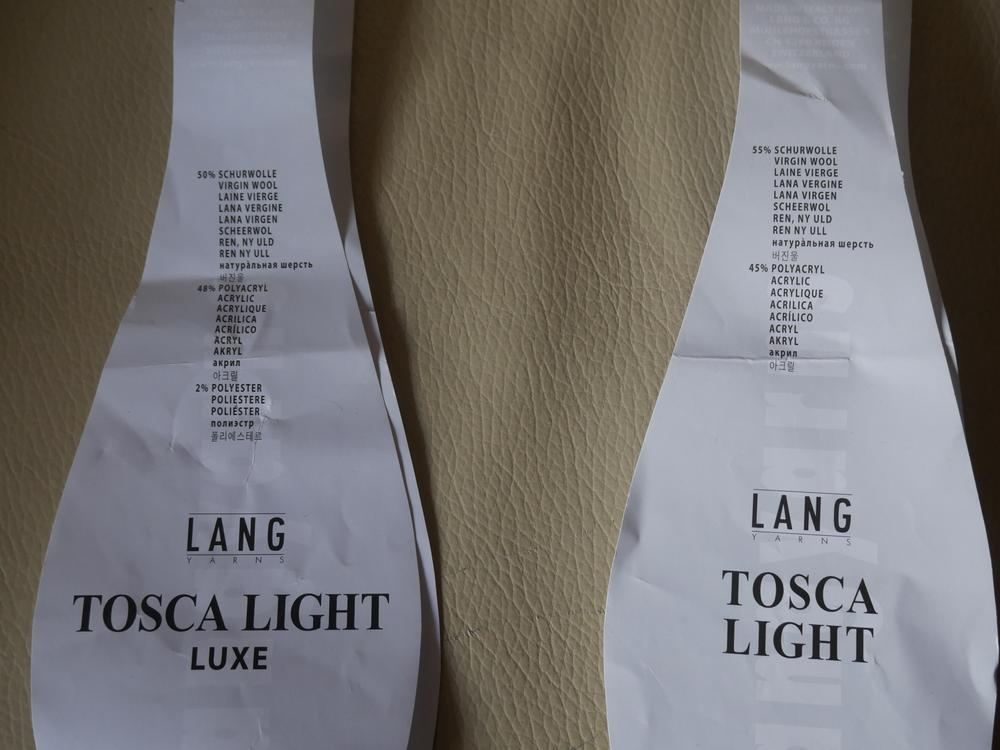

Ich habe für diesen Schal insgesamt vier Knäul Tosca Light verstrickt mit je einer Lauflänge von 400 Metern. Dementsprechend lang ist mein Schal, ich kann ihn dreimal locker um meinen Hals schlingen...Gestrickt habe ich mit Nadelstärke 4,5 und ich habe von beiden Seiten gestrickt, also so als wenn ich die Ärmel für einen Pullover abwechselnd stricken würde. Am Ende habe ich in der Mitte von beiden Nadeln zusammen abgekettet, so spare ich mir das Vernähen.

Mit der Tosca Light Luxe schlug ich 33 Maschen an, das Bündchen wird bei mir mit einer Masche rechts einer Masche links gestrickt. Im Folgenden werden die Randmaschen gestrickt wie gesehen. 
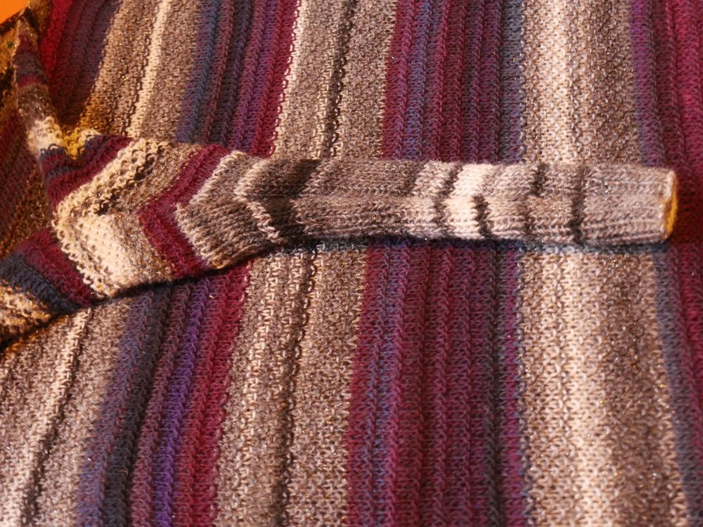
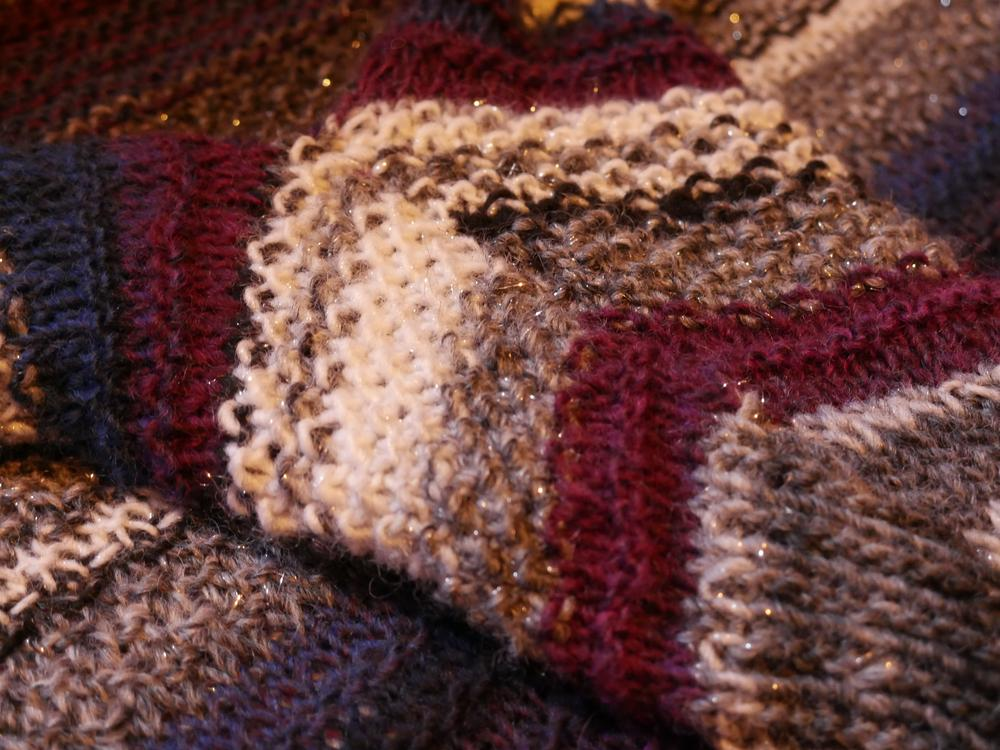
Alle 10 Reihen wird auf beiden Seiten eine Masche zugenommen (jeweils eine nach der ersten Randmasche und vor der letzten Randmasche), ich habe dort einen Umschlag gemacht und diese Maschen dann in der nächsten Reihe verschränkt abgestrickt. So wird verfahren, bis 45 Maschen auf der Nadel sind, danach werden noch 10 weitere Reihen gestrickt und eine mit der üblichen Zunahme. 
Jetzt beginnt bei mir der Farbwechsel zu Violett und mit dem Garn stricke ich dann auch die voher getätigten Zunahmen verschränkt ab. 
Ab hier wird in jeder 5. Reihe auf beiden Seiten eine Zunahme gemacht, bis 83 Maschen auf der Nadel sind, danach gibt es keine Zunahmen mehr und der Schal wird mit gleichbleibender Maschenanzahl weitergestrickt, bis keine Wolle mehr da ist oder die Wunschlänge erreicht ist. Wenn ihr, so wie ich, einen Farbwechsel und wechselnde Muster habt kann es hilfreich sein sich Maschenmarkierungen zu setzen. 

Die Tosca Light Luxe in verschiedenen Grauvarianten hat einen Glitzerbeilauffaden und wird in meinem Fall als Perlmuster gestrickt (eine Masche links und eine Masche rechts versetzt), bei meinem Schal sind immer 16 Reihen mit dieser Farbe gestrickt.
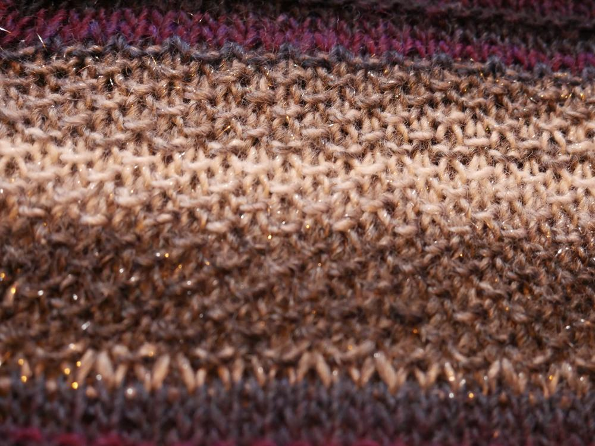

Die Tosca Light in Violetttönen wird glatt rechts gestrickt, wobei in jeder 3. Reihe eine Rippe gestrickt wird (1.Reihe rechts; 2.Reihe links; 3.Reihe rechts; 4.Reihe rechts = Rippe; 5.Reihe rechts; 6.Reihe links; 7.Reihe links = Rippe; 8.Reihe links...), bei diesem Muster habe ich immer eine Rippe mehr pro Mustersatz gestrickt, also beim ersten Mal nur eine Rippe, beim zweiten zwei und so weiter. Das Rippenmuster hat den Vorteil, dass sich der Schal an den Rändern nicht verkräuselt.
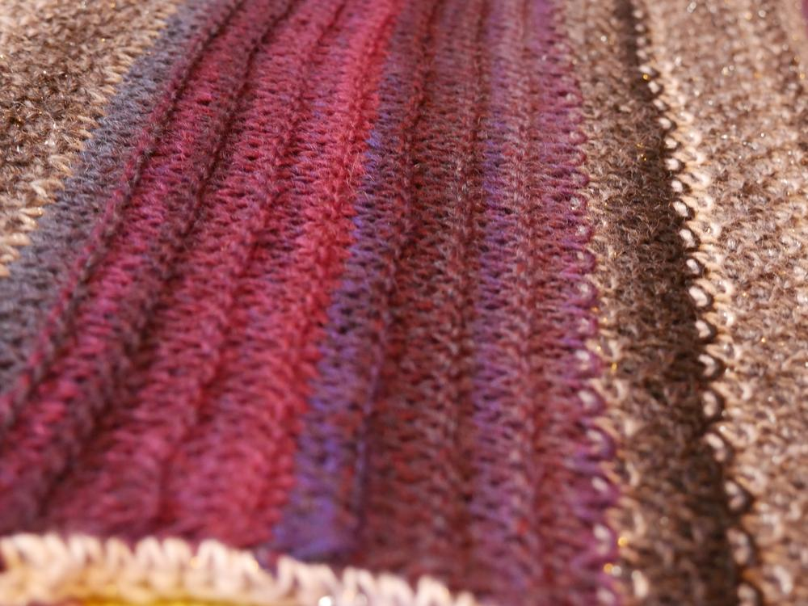

Durch seine Länge musste ich den Schal doppelt legen zum Spannen. Er hat sich einmal durch mein Wohnzimmer geschlängelt. 
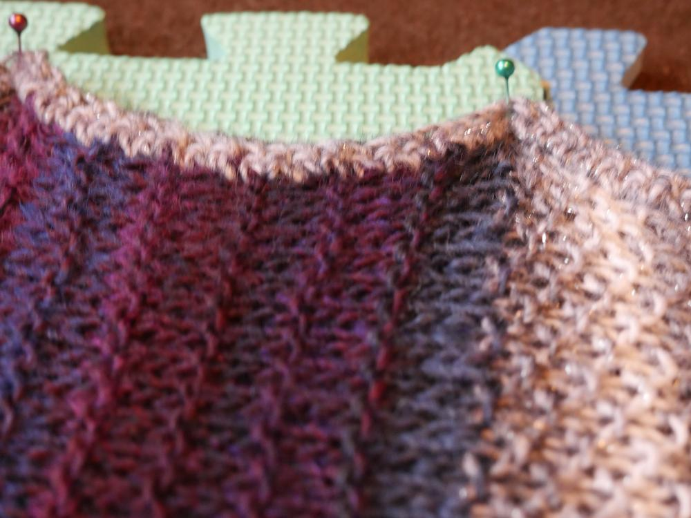
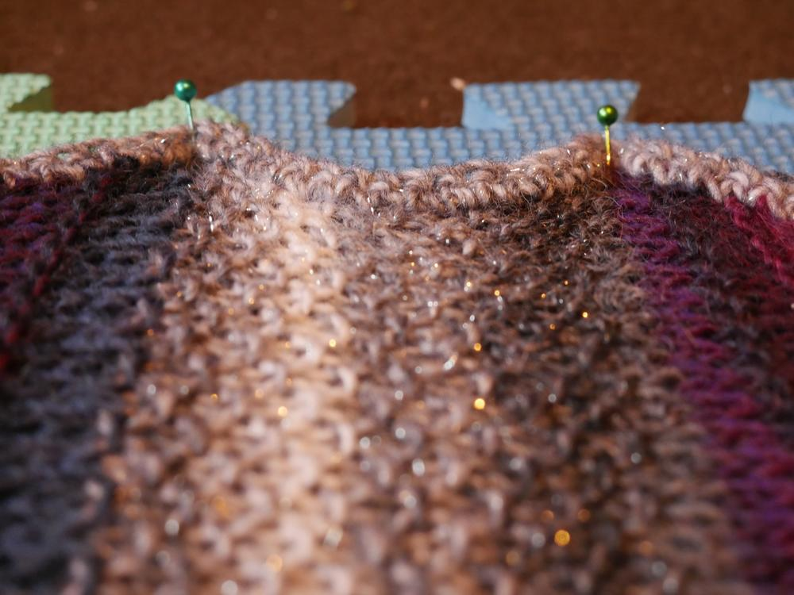
Das ist im Übrigen das erste Mal für Jemima gewesen, dass sie meine Schaumstoffpuzzlematten im Einsatz erlebt hat, das hat sie scheinbar nicht kalt gelassen, wärend Shubia immer nur interessiert zuschaut. 
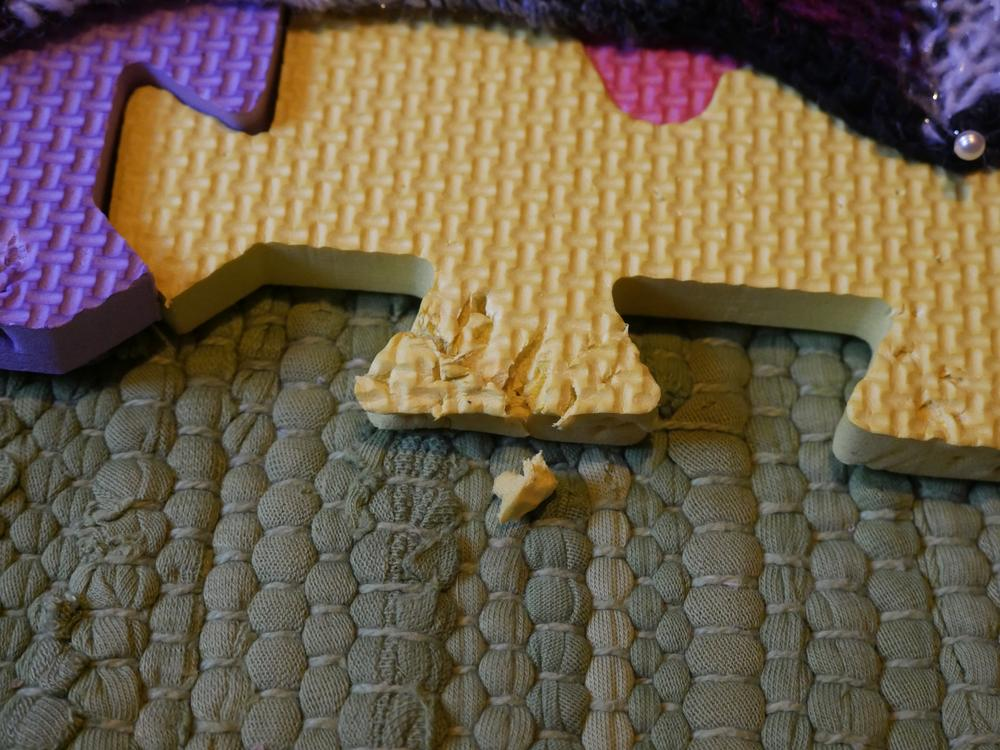
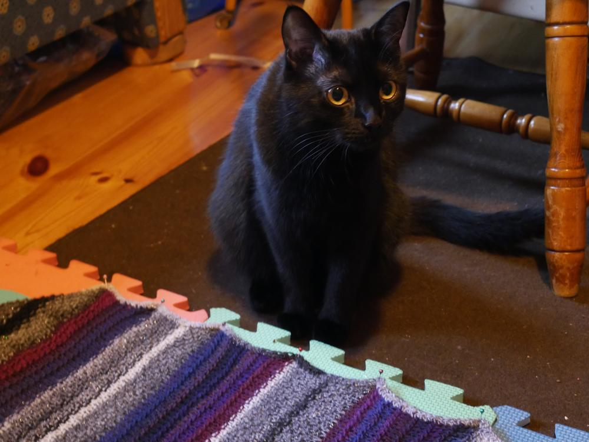

Die übrige Wolle habe ich an den Rand gehäkelt, unter anderem um die Fäden vom Farbwechsel zu verdecken. 
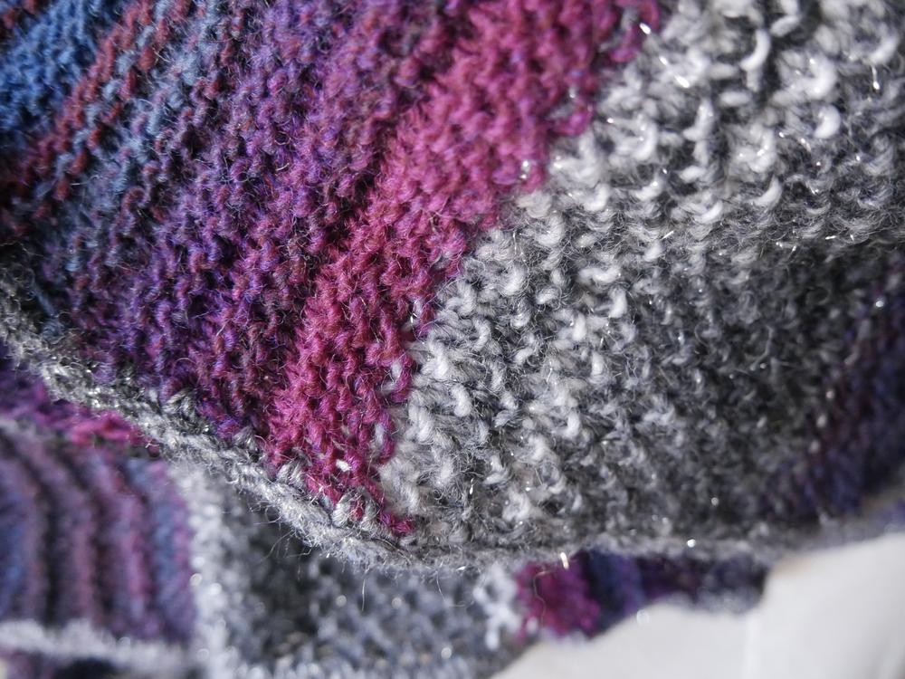
Jetzt habe ich definitiv einen kuscheligen Schal, der mit seiner enormen Länge von über 3 Metern große Variationsmöglichkeiten beim Tragen bietet, also quasi von Mumifizierung bis Schlabberlook ist alles drin und gleichzeitig hält er meine Arme warm.
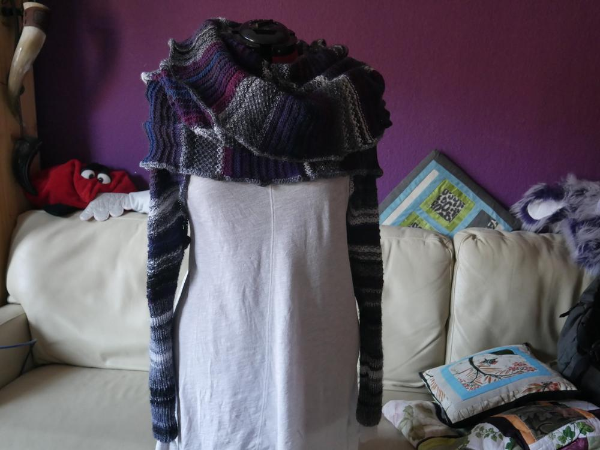
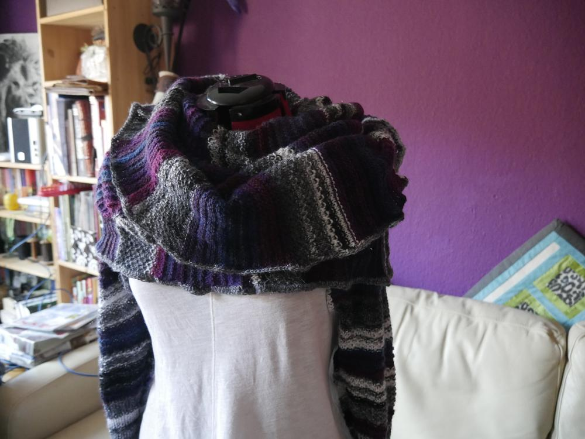

