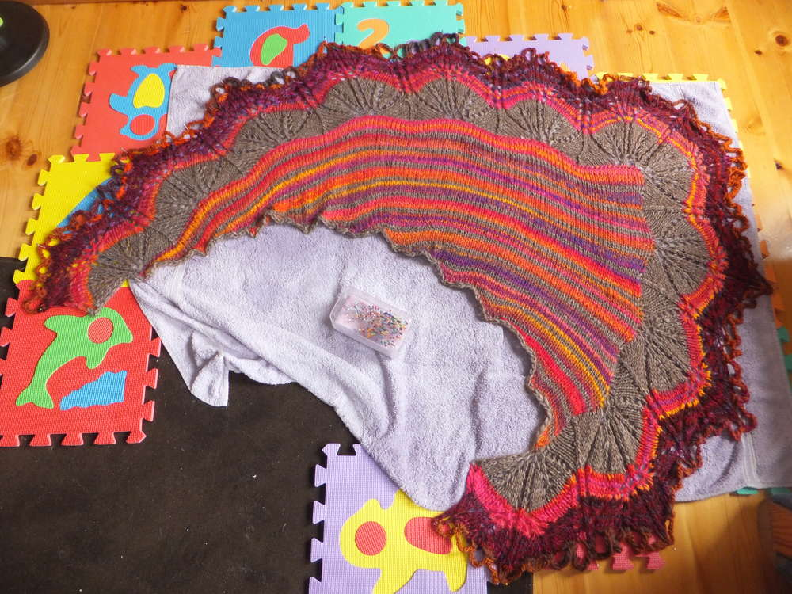
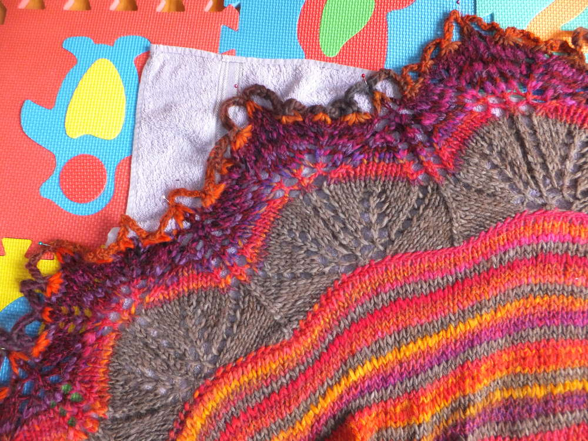
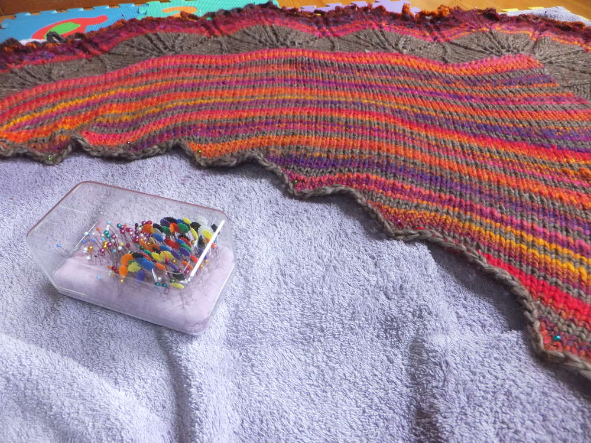
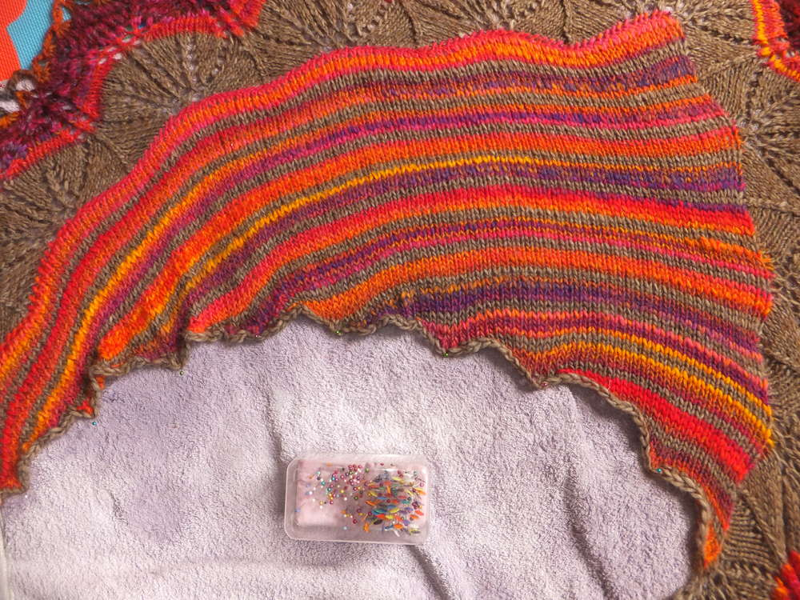
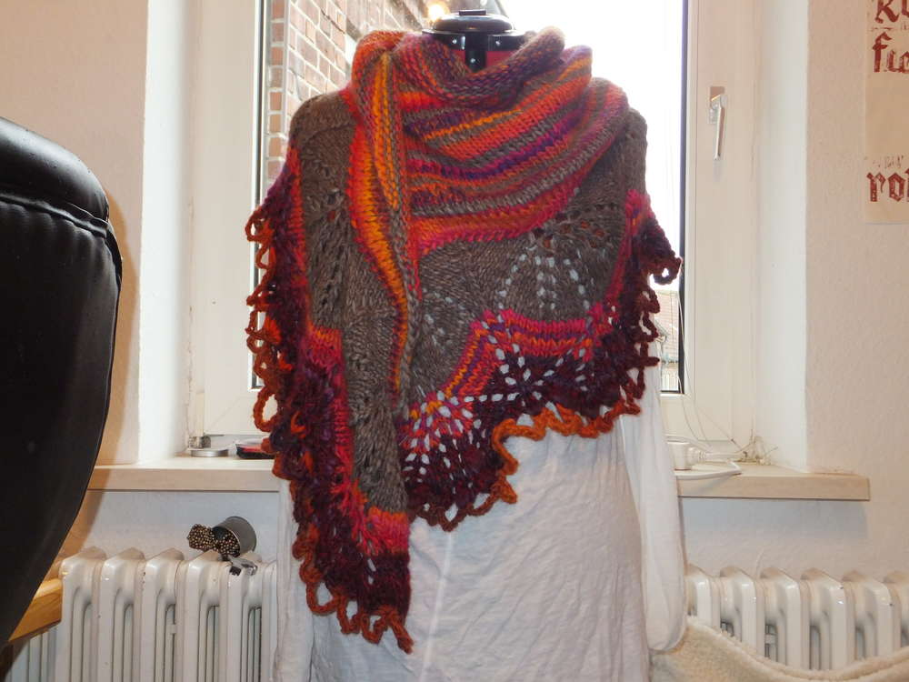
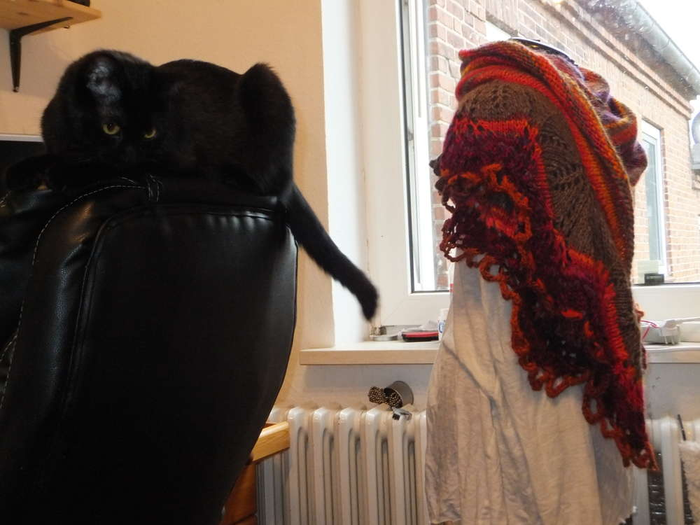
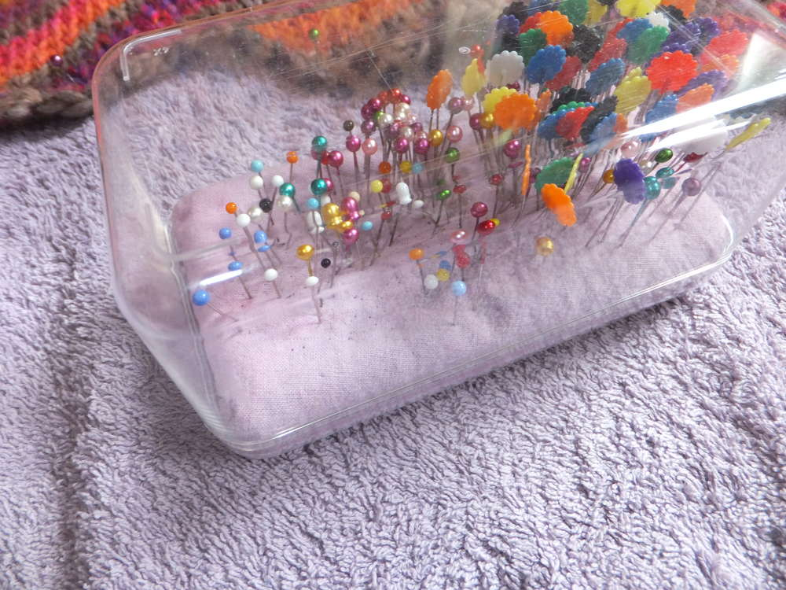
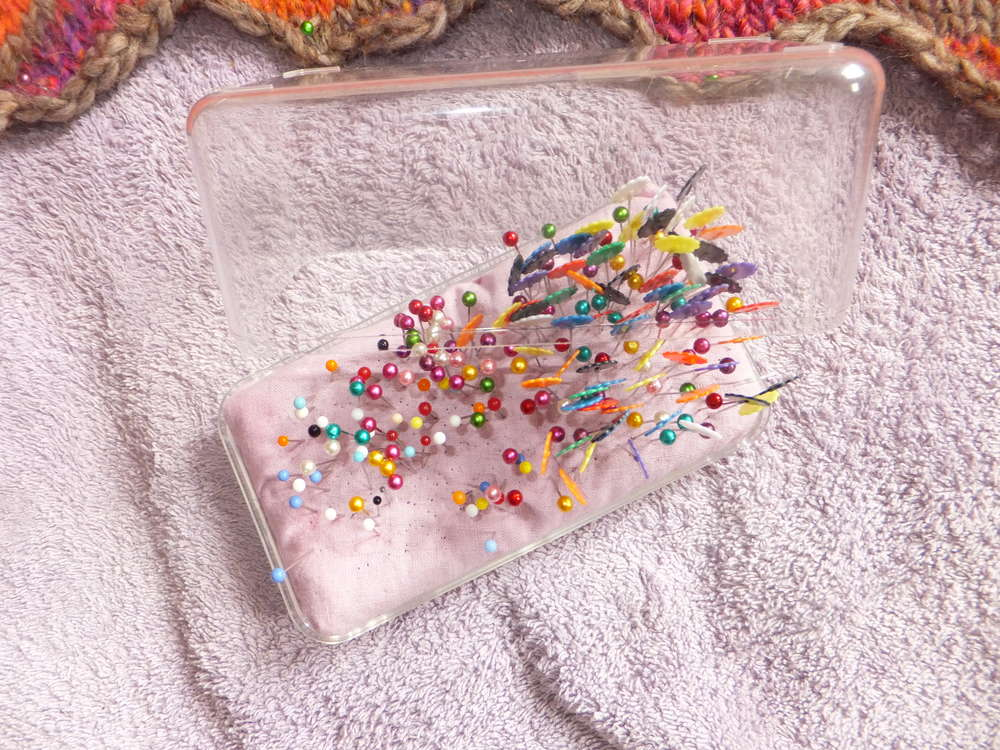

Das ich Wolle mag, sollte mittlerweile bekannt sein. Ich habe mich mal wieder ans Stricken gemacht und mich mit meiner Lieblingswolle Olympia von Lana Grossa an diesen Halswärmer aus verkürzten Reihen und einem Hauch Lace ausgetobt. Meine Vorlage ist der [Autumn Shawl](http://www.ravelry.com/patterns/library/autumn-shawl-4) von Irena D's Ravelry Store von Ravelry. Das Tuch ist mit der dicken Wolle wahrlich riesig geworden, das ließ sich auf der Nadel noch gar nicht richtig bemerken. Ich liebe die tollen Farben und bin gespannt, was ich mit den neuen 5 Knäulen Olympia anfange, die ich heute für nur 6,50 auf dem Flohmarkt erstanden habe, daraus wird irgendwas Lila-Grün-Oranges zum Kuscheln, vielleicht eine Looputze oder ein Scoody oder oder oder ;). 

Ich habe auch mal festgehalten, wie ich meine Stecknadeln katzensicher aufbewahre, alles was man braucht ist eine alte Ferrerodose und ein wenig Schaumstoff.

