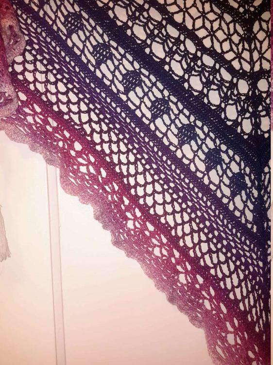

Jetzt wo es kälter ist, kann endlich wieder gestrickt und gehäkelt werden. Ich habe mich hinreißen lassen, eine Bestellung zu tätigen, ich kaufte bei [Wollschnassel](http://www.wollschnassel.com/) sogenannte Schnasselchen auch bekannt als Bobbel, dabei handelt es sich um gefachtes Garn, wo mehrere Fäden nebeneinander her laufen und durch kleine Knötchen kann ein Farbverlauf erzielt werden. Bisher habe ich dort die gefachten Garne am günstigsten mit der größten Farbauswahl gefunden. Mit dieser Wolle wollte ich dann mal wieder ein Dreieckstuch fertigen, diesmal wagte ich mich zum ersten mal daran ein Tuch zu häkeln. Es sollte das [Edlothia](http://www.ravelry.com/patterns/library/edlothia) sein, dafür benötigt man ca. 1000 Meter von dem dreifädig gefachten Garn und eine Nadelstärke von 3,5. Die Anleitung gibt es kostenlos bei Ravelry. Nach anfänglichen Problemen mit der geschriebenen Anleitung und einem darauffolgenden Aufribbeln des Projektes, startete ich erneut und hielt mich an die Häkelschrift. Wieder erwarten fiel es mir mit dieser wesentlich leichter, beim Stricken komme ich jedoch mit geschriebenen Anleitungen besser klar. Nach einigen Wochen habe ich nun mein Tuch fertig und muss feststellen, dass es ganz geschmeidig fällt und doch recht schwer wirkt, fast als hätte ich mit Baumwolle gehäkelt. Diese Wolle ist nicht sehr fluffig, aber man kann dadurch sehr klare Muster abbilden und sie fusselt nicht. Verzeiht die Fotos, der Kameraakku war leer und ich musste auf die Alternativen zurückgreifen ;) 

 

Sollte man es nicht erkennen, es gibt hier einen Farbverlauf von schwarz über blau zu lila (Kayla-Schnasselchen) und dann fortgeführt von lila über rosa zu weiß (Walbeere-Schnasselchen). Ich hatte vom weiß noch ein paar Meter übrig, da ich sehr eng gehäkelt habe und daraus habe ich mir dann für alle drei Ecken eine Troddel gemacht.

