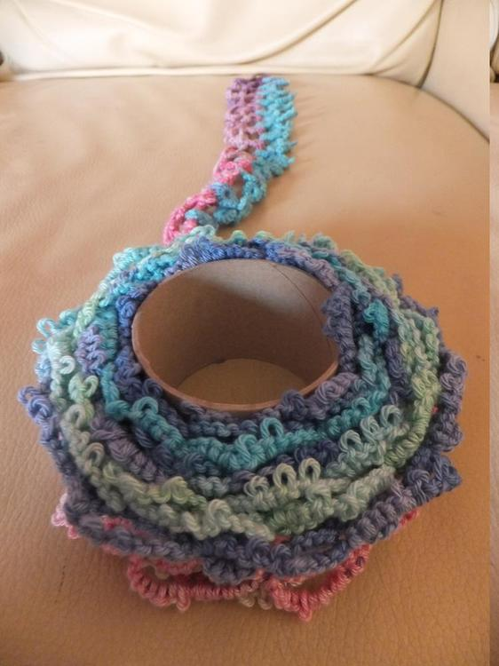
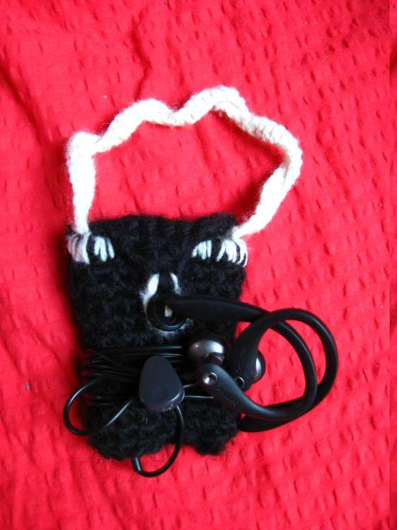

Da ich heute meine Zeit (tatsächlich zum Verkaufen!!!) auf dem Flohmarkt verbracht habe, gibt es heute mal kein aktuelles fertiges Projekt, sondern ein paar ältere fertige Projekte. 
Ich habe einige WIPs herumliegen, davon gibt es dann nächste Woche Neues zu sehen.

Vor einiger Zeit hatte ich für eine Freundin diese Mütze gestrickt. Sie ist mit der Doubleface-Technik gestrickt und den Totenkopf habe ich selbst entworfen. Ich hoffe, die Mütze hält noch schön warm.

Diese Occhi-Spitze habe ich für meine Mutti gemacht, die kann sowas immer gebrauchen und ich war gerade von der Occhi-Technik angetan und hatte nach den Prüfungen nichts sinvolleres in der Schule zu tun. Das dürfte nun ziemlich genau ein Jahr her sein, in dem Sinne schöne Grüße an meine ehemaligen Lehrer, ich habe meine Zeit sinnvoll genutzt, neben dem vielen Filme-schauen und Frühstücken.

Dieses kleine Helferlein, sorgt seit einger Zeit dafür, dass mein MP3-Player noch so aussieht wie am ersten Tag. 

Die kleine, ohne Anleitung, gehäkelte Fledermaus kam mir sowohl bei meinem Job im Grusellabyrinth als auch bei einem meiner Praktika zum Einsatz.

An diesen zusammengehörigen Handschuhen habe ich das Fingerhandschuh-stricken geübt, um es nach Beendigung dieser auch gleich wieder zu lassen. Ich habe hier mit der Asymmetrie gespielt und zwei verschiedene Farbkombinationen der Wolle genommen. Der graue Handschuh hat somit eine grüne Stulpe und anders herum, genauso habe ich auf beiden Stulpen ein anderes Motiv. Wie sich herausgestellt hat, kommt nicht jeder damit klar, ich schon. :)

Dieses Tuch kennt ihr auch schon von meinem [gut-betucht-Post](/2015/07/gut-betucht/), dieses Muster ist sehr einprägsam und man kann auf diese Weise auch einzelne Knäul Wolle sehr effektiv nutzen. Der blaue Revontuli ist aus einem meiner ersten selbstgesponnenen, greifädigen Garne gestrickt.
 

Auch dieses Werk ist doppelt gestrickt und schützt etwas Wichtiges von mir, nämlich mein Gedichtbuch. 

Zum Schluss ist hier noch eine Handyhülle der euligen Art. Einer Bekannten ging ihr Handy kaputt, damit es nicht schlimmer wurde bekam sie zum Geburtstag diese gehäkelte Schutzeule.

Ich werde mich jetzt erst mal von den Strapazen des Flohmarktes erholen und hoffentlich ein Paar meiner WIPs fertigstellen.
