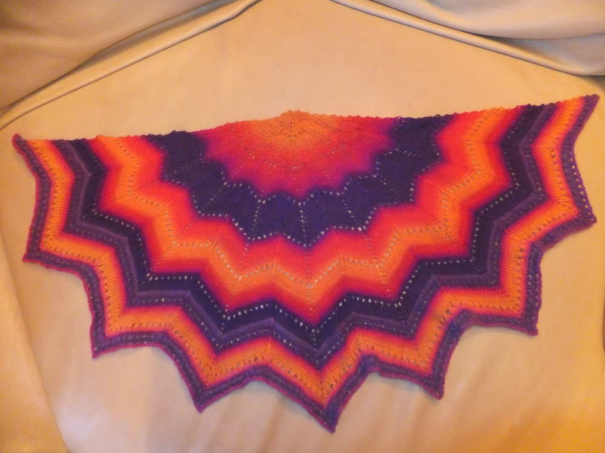
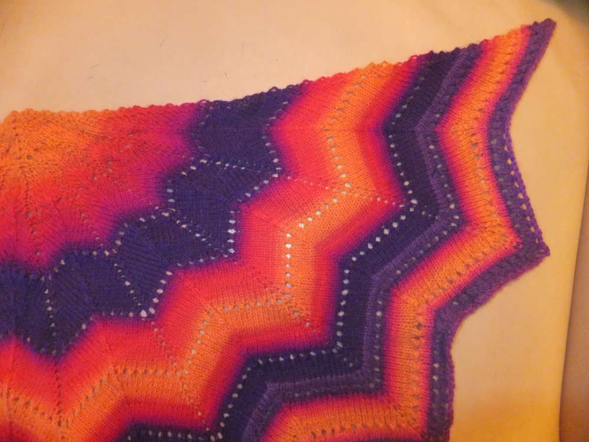

Lange hab ich mich nicht mehr um das Flauschiversum gekümmert, ich habe so einiges privat in dieser Zeit geregelt und jetzt genieße ich die Ferien und möchte euch zeigen, was so in der Zeit entstanden ist. Erinnerst du dich noch an meinen Post zur [unterstützten Spindel](/2015/05/unterstutzte-spindel/)? Ich habe in Anlehnung an die Anleitung des "Revontuli" von [Ravelry](https://www.ravelry.com/account/login) dieses Tuch aus der Wolle gestrickt, die ich selbst gesponnen habe. Es handelte sich um Fingergarn von SchoppelWolle und ich verarbeitete insgesamt zwei Knäul von jeweils ca 250 Meter Länge. Dieses Tuch benötigte von mir sogar doppelten Arbeitsaufwand. Ohne mich zu erinnern, dass ich diese Wolle in einer ähnlichen Tönung schon einmal gekauft und verarbeitet hatte, habe ich mich an das zweite Knäul gemacht, das ich besonders fein versponnen habe um es dann in der Navajo-Technik zu verzwirnen, auf diese Weise wollte ich den Farbverlauf erhalten. Als dieses Knäul bereits angestrickt war, entdeckte ich das erstgeborene nicht ganz so fein gesponnene und lediglich zweifach verzwirnte Knäul. Ich habe mich dazu entschlossen besagtes Knäul wieder zu entzwirnen (sowas macht man eigentlich nicht) und es erneut zu spinnen bzw. es auszudünnen (das war nur möglich, weil ich unsauber gearbeitet hatte und es eines meiner ersten Spinnarbeiten mit Fingerwolle war) um es dann auch in der Navajo-Technik zu verzwirnen um damit weiterstricken zu können. Einen kleinen farblichen Unterschied sieht man wo ich das Knäul wechselte, aber das stört mich nicht. Mit einer kleine Fibel oder einer Tuchnadel ist es ein leichtes, kuscheliges Tuch für kühle Abende. Und ich arbeite schon an meinem nächsten Tuch, diesmal in größer und ohne selbstgesponnene Wolle.

