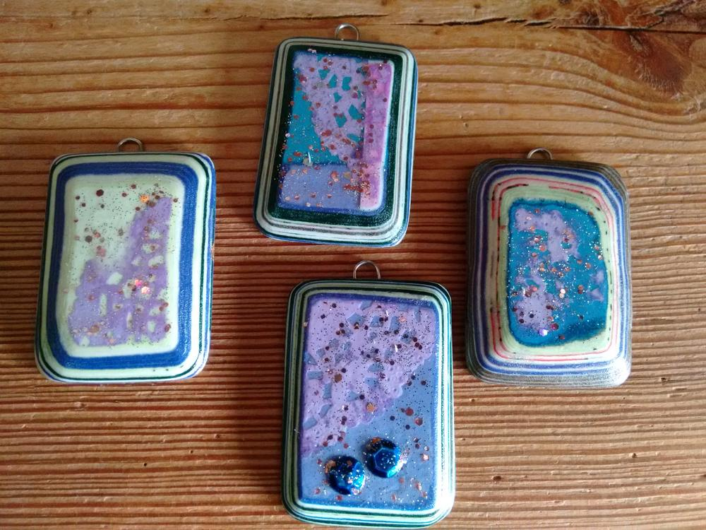
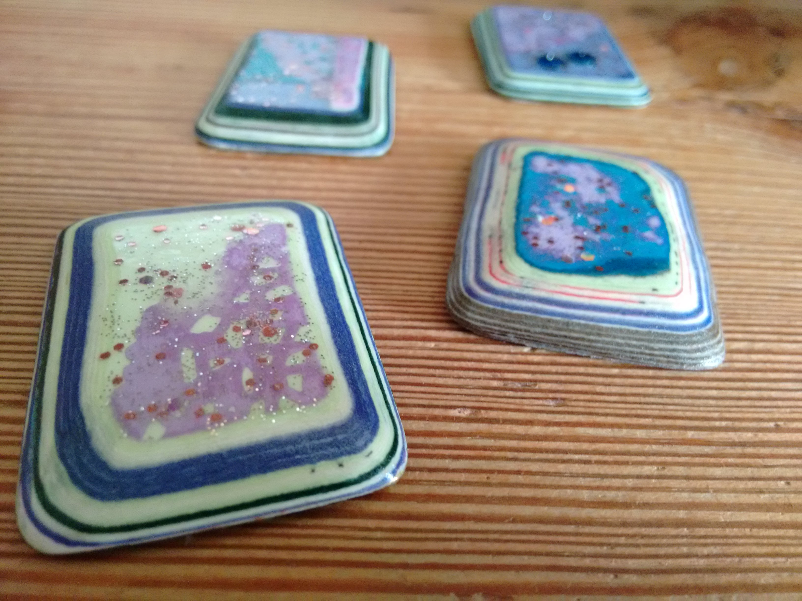

Ich habe mal wieder auf Pinterest gestöbert und dabei eine interessante Bastelei gefunden. Man kann mit dieser Methode nette kleine Anhänger für Halsketten herstellen, kann aber auch kleine Bildchen damit machen, die man dann in einer Gruppe an die Wand hängen könnte.

Ich habe mir ca. 3 x 4 cm große Papierstücke aus buntem, möglichst dickem und durchgefärbtem Papier zugeschnitten. Sie sollten schon gerne schön gleichmäßig groß sein, dann funktioniert es am besten. Dann habe ich Holz- bzw. Bastelleim mit ein wenig Wasser verdünnt und mit einem dünnen Pappzuschnitt in derselben Größe als Basis begonnen. Mit einem Pinsel wird jedes Papierblättchen satt eingestrichen und dann bündig auf das vorherige geklebt. Für dünne Seitenstreifen mal nur eine Farbe, für dickere Streifen habe ich mehrere gleichfarbige aufeinander geklebt.

Das macht man so, bis eine Höhe von etwa 5 mm erreicht ist. Obenauf habe ich bei meiner Version noch Schnipsel eines farbigen Tortendeckchens platziert. Ja, und dann muß der ganze Block mindestens einen ganzen Tag trocknen.

Man wartet also geduldig auf einen regenfreien Tag, um das Kunstwerk weiter zu gestalten, denn nun kommt Schleifpapier in unterschiedlichen Körnungen ins Spiel, und das macht genügend Schweinkram, um die Angelegenheit lieber im Freien zu erledigen, es sei denn, ein Hausputz steht unmittelbar bevor.

Man braucht schon einige Geduld, um mit der Hand die Kanten so schräg zuzuschleifen, daß ein deutliches Streifenmuster entsteht. Ich habe meinen Dreieckschleifer zu Hilfe genommen. Besser geht es noch mit einem Bandschleifer. Aber bitte, bitte ACHTET AUF EURE FINGER!!!

Wenn die Teile für euren Geschmack glatt und schräg genug sind, dann müssen sie nur noch mit einem trockenen Tuch von Staubresten befreit, ein Aufhänger angeklebt und mehrfach klar lackiert werden. Ich habe es hier mit Nagellack gemacht. Die letzte Schicht war übrigens Glitzerlack.

Die nächsten Blöcke sind etwas kleiner und schon zusammengeklebt. Und diesmal habe ich obenauf ein kleines Blumenbild bzw. ein Stück vergilbtes Papier aus einem alten Buch gelegt.

........Ich warte jetzt auf einen regenfreien Tag........ Liebe Grüße Lucy

