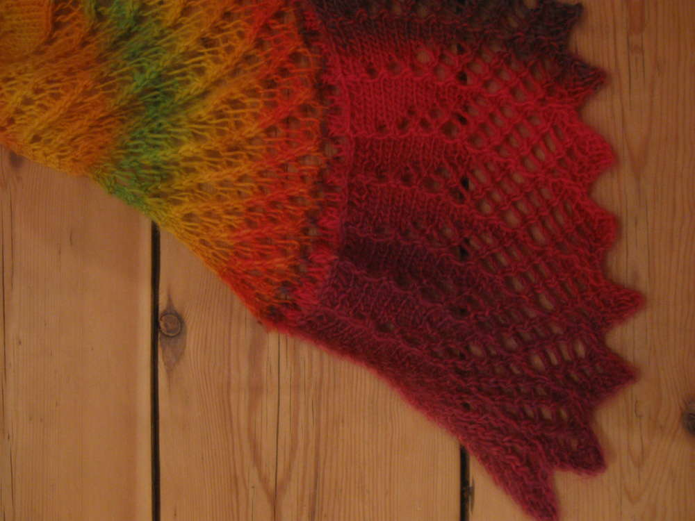

Hier mein Lieblingsschal nach einer Anleitung von [Ravelry](https://www.ravelry.com/account/login) in verschiedensten Ausführungen. Das war der Erste "In the Pink" und der hat mich auch die meisten Nerven gekostet, denn die Anleitung ist auf Englisch, du findest sie [hier](http://www.ravelry.com/patterns/library/in-the-pink-2). Trotzdem ist es der Schal mit dem man mich kennt, obwohl er zwei Fehler hat. Na, wer findet sie? Die Strickspitze habe ich auch schon bei anderen Tüchern verwendet zum Beispiel beim [Doubleface-Schal](http://flauschiversum.de/2014/01/doubleface/).

Das war ein Weihnachtsgeschenk für meine liebe Mama.

Und auf den hatte ich einfach Lust, jetzt trage ich ihn zu besonderen Anlässen, weil er in etwas gedeckteren Farben ist als mein erster Schal.
