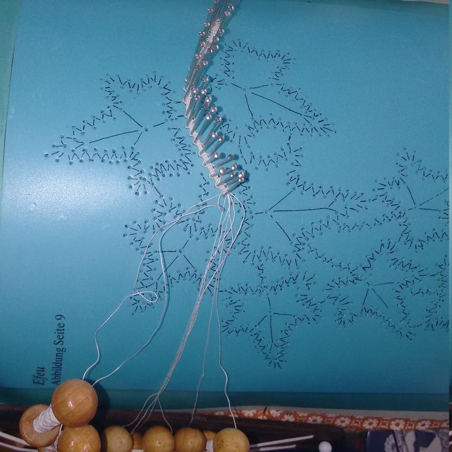
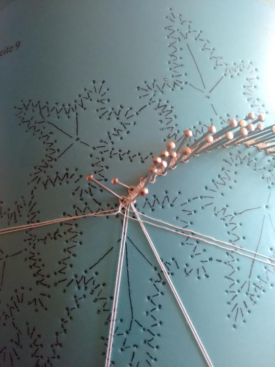
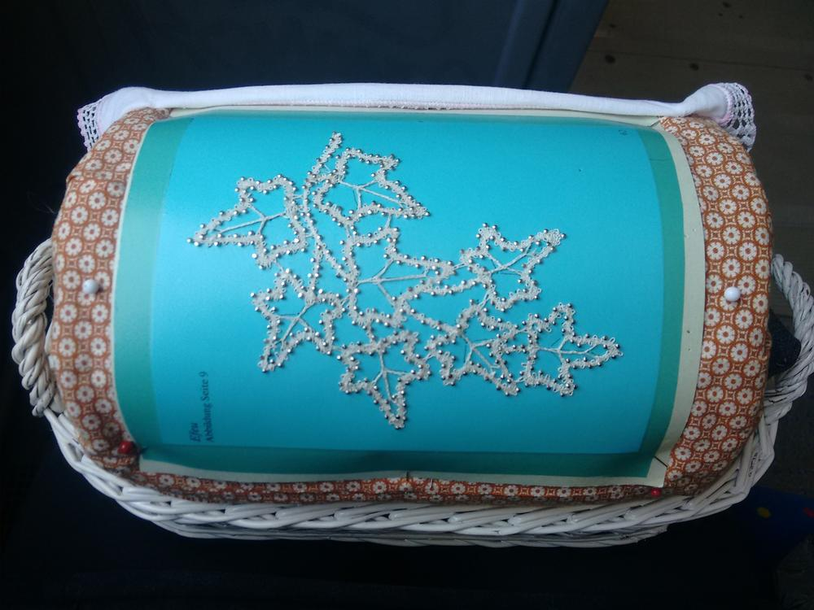
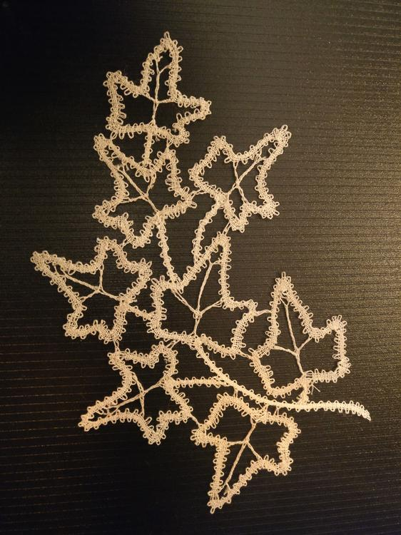

Ich klöppel mir einfach alles selbst. Ich habe ja schon angekündigt, dass da was neues kommt. Naja, da mein [Herz](/2018/08/kloppelherz/) ja ganz gut geworden ist, auf zu neuen Ufern, ich überspringe die Anfängerübungen und mache diesen Efeu im Leinenschlag mit falschen Flechtern. 

Der Klöppelbrief ist von Irmgard Schneider aus ihrem Buch Klöppelbilder aus der Natur. Hier konnte ich sehr gut das Ansetzen neuer Klöppel lernen, auch die falschen Flechter gelingen mir immer besser.  
Bei der Suche nach Klöppelbriefen stelle ich allerdings bisher fest, dass die Auswahl für meinen Geschmack sehr beschränkt ist. Ich bin da scheinbar zu sonderbar mit meinen Ideen und Wünschen, eventuell entwerfe ich mir doch schneller als gedacht was eigenes.  
Trotzdem finde ich bestimmt eine würdige Verwendung für diese Arbeit. Ich bin jedenfalls sehr stolz und durchaus zufrieden. Für die nächste Arbeit in der Art werde ich aber wohl von der Klöppelrolle auf das Klöppelbrett umsteigen, die Klöppel waren hier schwieriger zu händeln.

Ich denke die fertige Arbeit werde ich als Applikation auf einen Filzhut nähen, ich glaube das sieht später sehr schön aus aber bis es soweit ist dauert das noch. 
Schönen Restsonntag noch, Eure Ermeline.

