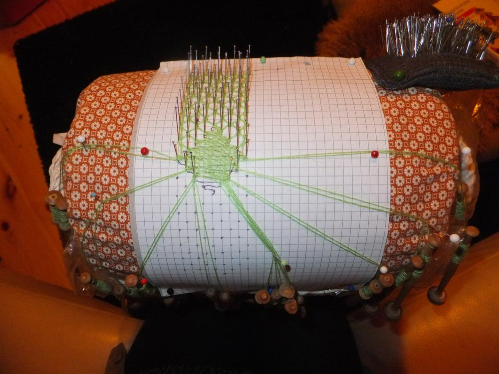
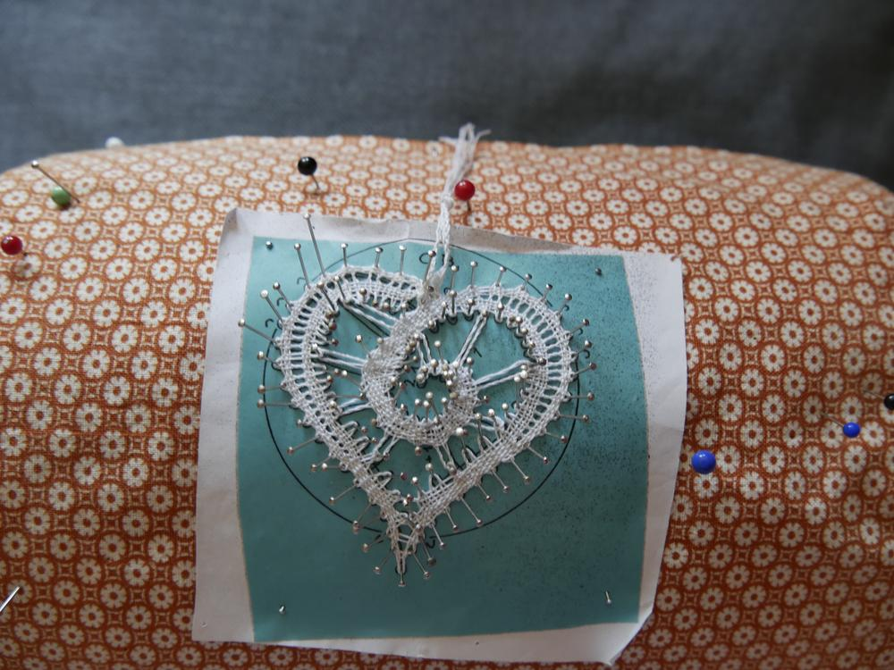

Jetzt klöppel ich mir die Welt widewidewie sie mir gefällt. Und angefangen hat die Geschichte vor etwa 4 Jahren auf einer Haushaltsauflösung einer handarbeitsfreudigen Dame. Lucy und ich erstanden für nur unfassbare 15€ eine sehr große Klöppelausrüstung, die wir teilten sodass jede von uns sich diesem Handwerk widmen könnte. 
Bei mir blieb es bei einem Lesezeichen mit Hilfe von Youtube. 

Das war schon in Ordnung aber verinnerlicht hatte ich die Technik nicht und hätte auch keine andere Vorlage als die im Video klöppeln können. Also wurde wieder alles eingemottet, bis zu jenem Tag...
In diesem Fall der 28. Juni diesen Jahres, an dem ich mehr als überrascht wurde von dem Ausmaß der Aussage: "Meine Ma sortiert aus, da sind auch ein paar Klöppelsachen und so dabei..." Ich natürlich Feuer und Flamme: "OMG Jah, da habe ich definitiv Interesse dran!" Ja und dann trudelten diverse Tüten gefüllt mit Alpaka-, Tweet- und anderen schönen Garnen ein, eine große Tüte voll mit Lederresten und eine komplette Klöppelausrüstung. 

Viele spannende Bücher und Hilfsmittel sowie verschiedenste Klöppel gab es zu entdecken.

Ich freue mich immer wieder, dass des Ermelinchens Ruf so laut in die Welt getragen wurde, dass dem Flauschiversum eine solche Unterstützung zuteil wird. Die Bastelutensilien und Handarbeitssachen finden auf den spannendsten Wegen zu mir. Nachdem ich meinen Schatz gesichtet hatte, musste an der Klöppelfront endlich was passieren. Also checkte ich die Seite des Hof Akkerboom ob denn endlich mal wieder geklöppelt würde und dann nix wie hin da. Ich musste mich noch bis zu 31. Juli gedulden aber es lohnte sich wirklich. Noch garnicht richtig Hallo gesagt und schon waren mir diverse helfende Hände gereicht. Naja und nachdem ich dann gelernt habe, wie man Klöppel wickelt und weitere Klöppelpaare mitten in einer Arbeit hinzufügt, waren die ersten Zentimeter meiner zweiten Arbeit überhaupt, schon gemacht. 

Lucy und ich klöppelten gemeinsam am Herzen und auch wenn ich es nicht noch beim Treffen selbst fertig bekommen habe, so war es doch vor dem nächsten Treffen drei Tage später schon fertig abgenadelt und ich mehr als bereit für das nächste Projekt. 

Und das sind nun meine ersten zwei Projekte nebeneinander, das [dritte](/2019/02/kloppelefeu/) ist schon auf dem Kissen, aber das ist ein anderer Post.

Einen schönen Sonntag wünscht eure Ermeline.

