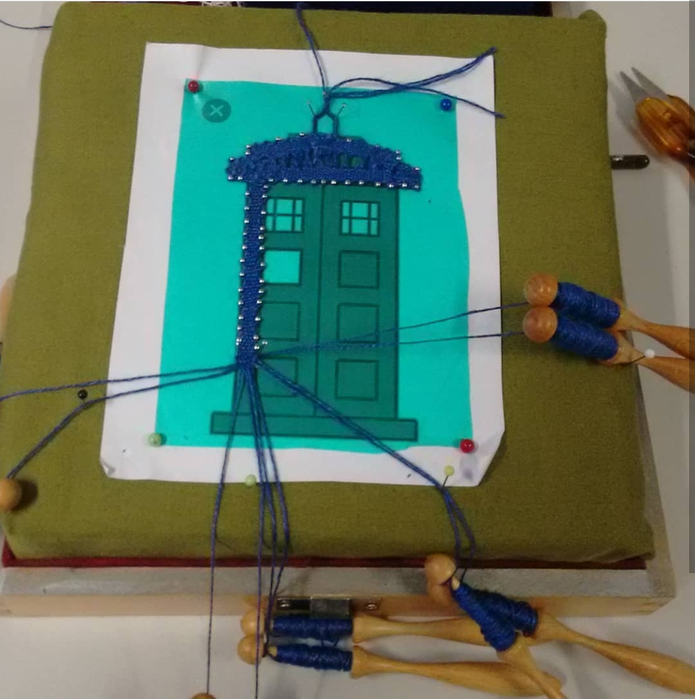

Das Klöppeln und die Tardis von Dr. Who haben es mir angetan. In letzter Zeit finde ich die Tardis sehr toll, da ich kürzlich mit dem Klöppeln begonnen habe und meine ersten Werke, [das Herz](/2018/08/kloppelherz/) und den [Efeu](/2018/08/kloppelefeu/) erfolgreich abgeschlossen wurden, habe ich mich mal an einen eigenen Entwurf getraut.
 

Entstanden ist hier die Tardis im Leinenschlag mit Löcherschlagelementen und falschen Flechtern in den Fenstern. 

Meine ersten Klöppelbriefe wiesen jedoch ein paar Denkfehler auf, weshalb ich noch ein paarmal umgestalten musste. 

Letztendlich ist dies mein dritter Versuch, der auch zum Ende gebracht wurde, auch hier hatte ich ein paar Denkfehler, zum Beispiel habe ich nicht spiegelverkehrt geklöppelt, denn nach der Fertigstellung wird die Arbeit umgedreht, weshalb das weiße Schild auf der falschen Seite war. In meinem Perfektionismuswahn habe ich das dann wieder korrigiert. Auch ist das Garn etwas zu dünn, aber was das angeht, stört mich das nicht so sehr, es half mir in diesem Falle die Fehler besser zu erkennen und ich habe dabei viel lernen können.

Um die Tardis dann in Szene zu setzen habe ich ein altes Poster vom Mars zurechtgeschnitten ein wenig Glitter und Wirbel hinzugefügt und die Tardis eingefügt. Dieses Bild schenkte ich einer Freundin, die auch sehr nerdig unterwegs ist. Bei ihr ist das Bild in besten Händen.

Ein spacetastisches Wochenende wünscht Eure Ermeline.
