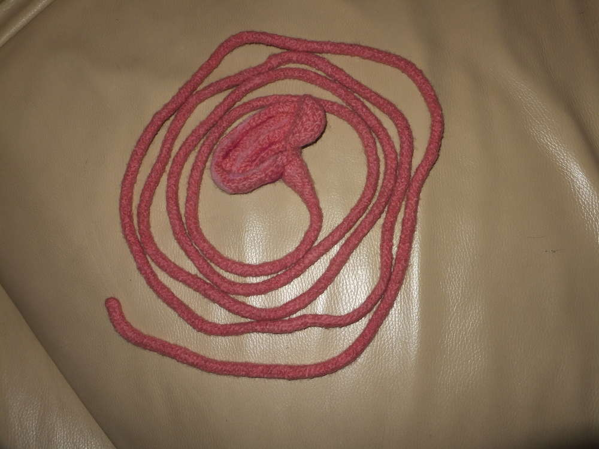
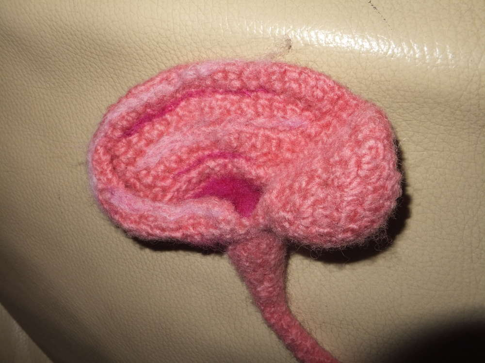

Wer nicht weiß was das hier sein soll, der denke jetzt bitte an Harry Potter... Die Weasley-Zwillinge... und Weaslys-Zauberhafte-Zauberscherze... jep, das ist ein Langzieh-Ohr. Erst mit Strick-Filzwolle gehäkelt, dann in der Waschmaschine gefilzt. Wie ich die Ohrform hinbekommen habe weiß ich selbst nicht mehr... aber ich habe recht lange herumprobiert...wenn ich nochmal eines mache werde ich mir definitiv aufschreiben wie ich das gemacht habe und dann hier ergänzen. Versprochen. 

Aber wozu braucht man das denn? Naja zum einen gibt es dadurch die Möglichkeit verflucht viele Redewendungen sehr bildhaft zu untermalen, wie zum Beispiel "Ich leih' dir mein Ohr" oder "ein Ohr abkauen" bis hin zum Rollenspiel wofür dies mal wieder dient, nämlich tatsächlich als Möglichkeit andere zu belauschen, wofür es auch bei Harry Potter verwendet wird.
