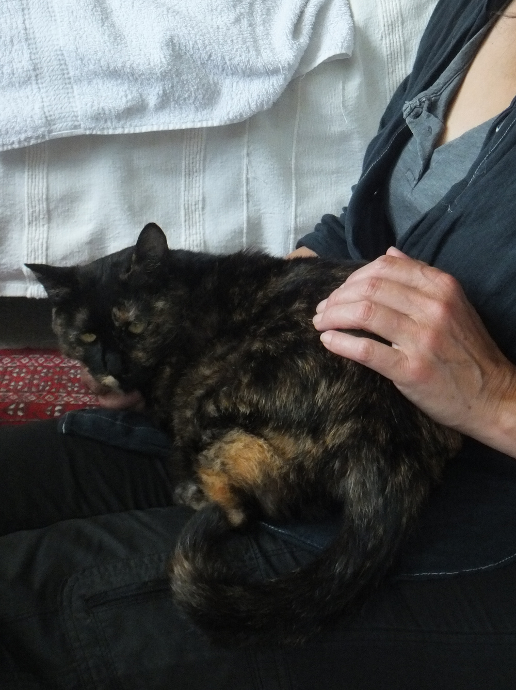
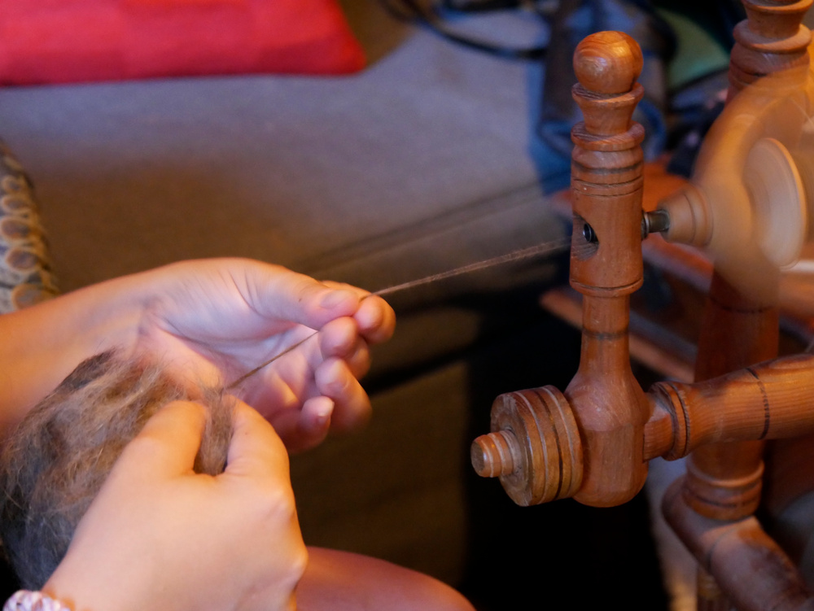
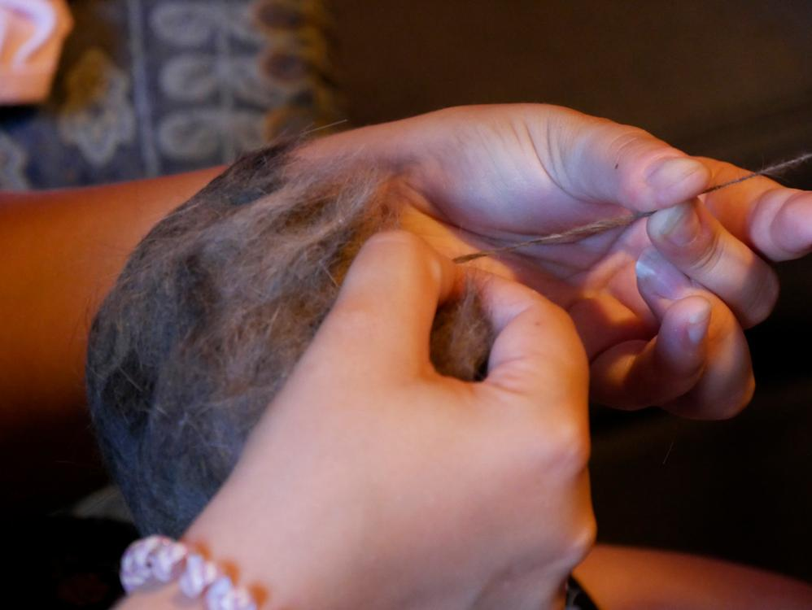
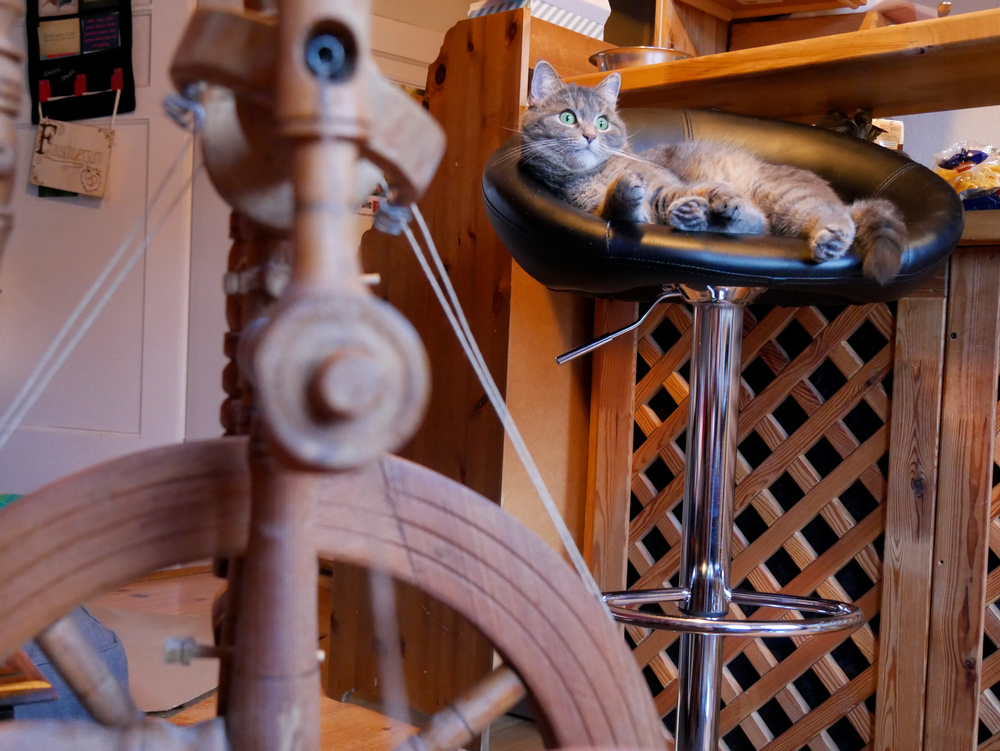
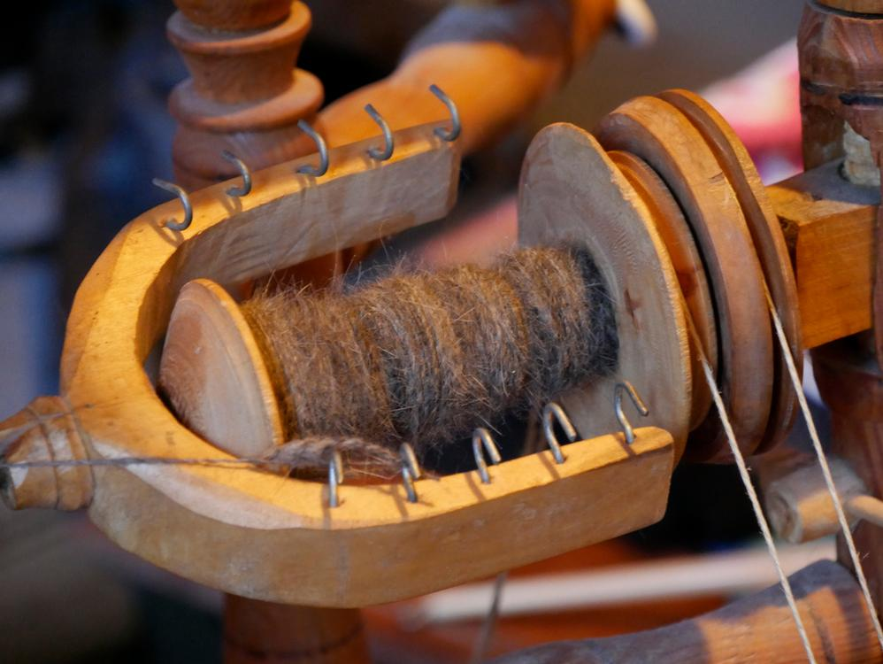
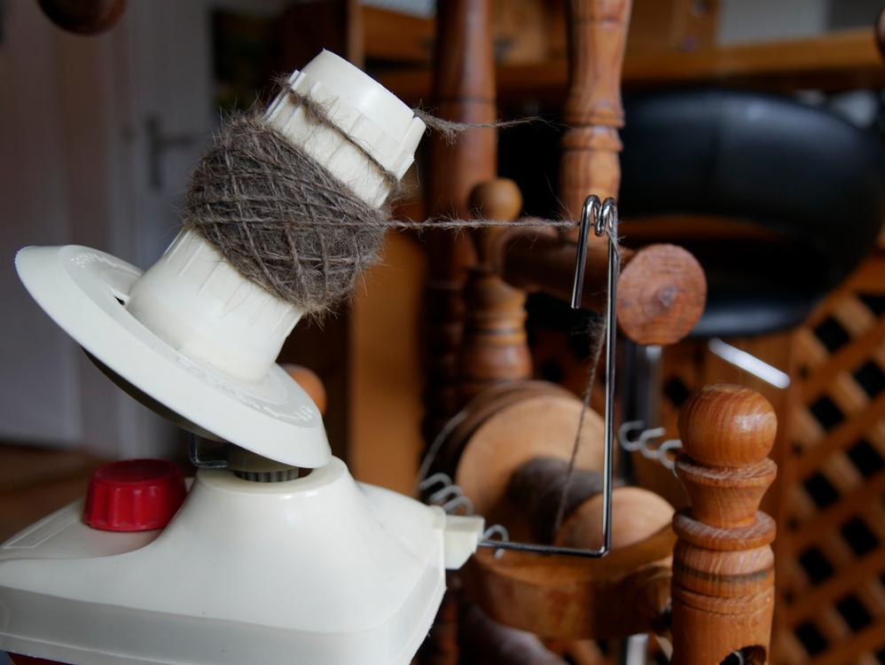
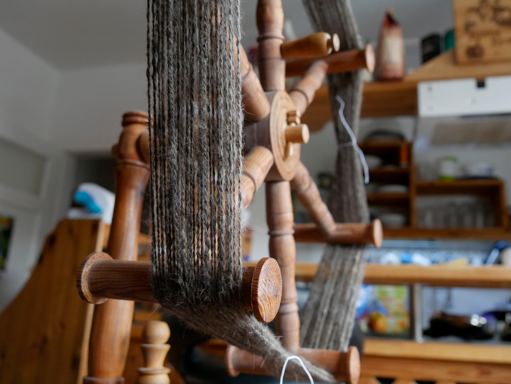
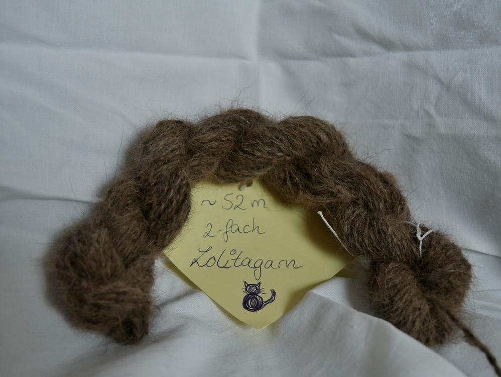

Wieder wurde eine Katze versponnen. Diesmal musste Lolita herhalten, oder viel mehr ihr Fell lassen. Lucy hat aus dieser süßen Katze ziemlich viel Wolle rausgekämmt.

Kennt ihr Lolita schon? Sie ist eine von Lucys Katzen und trotz ihrer anfänglichen Zurückhaltung und Fotoscheue sehr verschmust und freundlich. Schaut man in ihr Gesichtchen muss man Schmunzeln, denn die kurzsichtige kleine Mietz schielt und zaubert mit diesem Blick stets ein Lächeln in unsere Gesichter, außerdem macht Lolita Yoga wenn sie sich streckt, sie hat schon ein paar außergewöhnliche Eigenschaften.

Und ich habe mich darangemacht auch aus Lolita ein Knäul Wolle zu machen, wie ich es schon von [Jemima](/2018/03/jemimas-wolle/) gemacht habe. Dieses Fell war echt eine Herausforderung für mich. Es ist sehr fein und weich, jedoch auch unglaublich filzfreudig, sogar ohne Wasser und Seife. Ich musste immer in kleinen Flocken arbeiten und schon beim Transport von Lucy zu mir nach Hause hat sich das Fell enorm verdichtet. Aber bisher habe ich noch jedes Fell mit meinem Spinnrad bezwungen.

Meine beiden Flauschis waren während der Arbeit nie weit entfernt. Shubia war von dem Geruch der fremden Katze so verwirrt, das sie sich ständig an mir geschubbert hat, während Mimi das Ganze nicht so wirklich tangiert hat, die Vögel vorm Fenster waren viel spannender. 

Nach dem Verspinnen habe ich den Einzelfaden einen Tag ruhen lassen und am nächsten Tag zweifach mit sich selbst verzwirnt, auf diese Weise konnte ich möglichst viel Länge aus dem Material herausholen.

An dieser Stelle bin ich immer sehr dankbar für meinen Wollwickler, der es mir ermöglicht, den Faden von Innen und Außen zu greifen und restlos zu verzwirnen. Und er wickelt so schön schnell.

Nach dem Verzwirnen dann Haspeln und Waschen. Bei den Temperaturen ist das Garn im Null-Komma-Nix trocken gewesen. 

Die fertige Lolitawolle hat einen warmen anthrazit-braun Farbton, besteht aus 100% ausgekämmtem Katzenfell und ist definitiv nichts für Katzenhaarallergiker (Aber das trifft wohl auf das ganze Flauschiversum zu). Ich bin schon sehr gespannt, was Lucy aus den ca. 50 Metern Wolle macht, natürlich wird auch dieses Ergebnis dann hier gezeigt.

Bleibt flauschig, katzennärrisch und besonders, Eure Ermeline.

