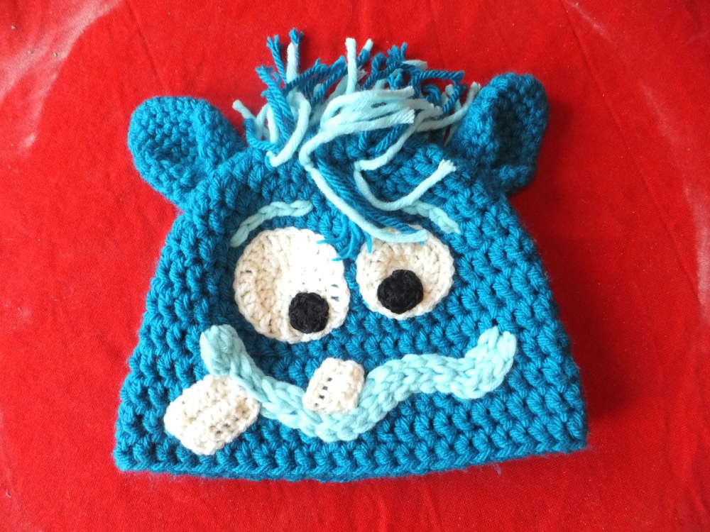
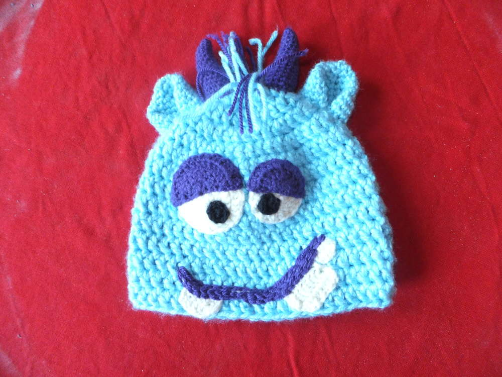
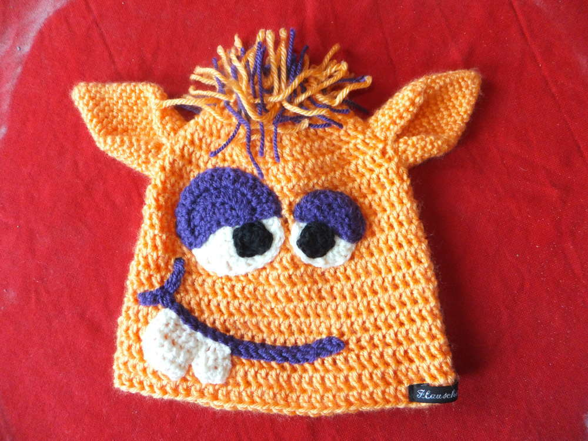
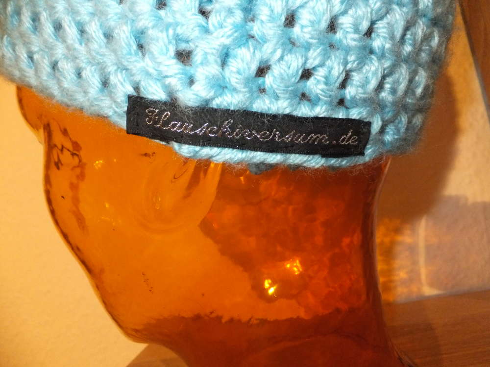

So dann wollen wir doch mal wieder was flauschiges teilen. Die Feiertage haben bestimmt viel von uns abverlangt und ich habe diese Zeit zum Entspannen und Produzieren genutzt... Hier sind sie meine Monstermützen. Jede ist anders aber doch liebenswert. Die hellblaue Mütze ist mehr was für Kinder von der Größe her aber wer unbedingt will bekommt sie auch auf einen Dickschädel von 50 cm rauf. Mal schauen wie die noch folgenden Familienmitglieder aussehen werden. Eine Basis-Anleitung für eine Mütze findest du auch im Beitrag [Mützekatze](/2014/05/mutzekatze/).

Achja und ich habe mir selbst zu Weihnachten einen Satz "Flauschiversum.de" Etiketten geschenkt. 
