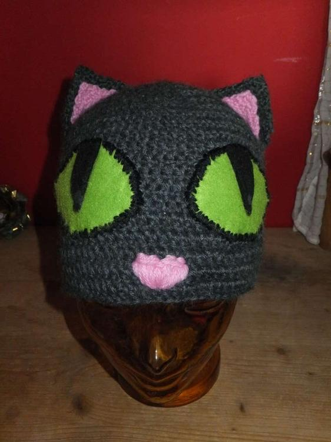
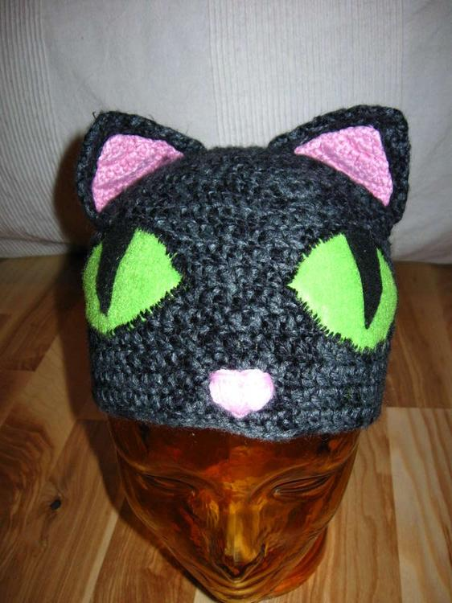

Tja, also Katzen mag ich echt gerne und es mag schon viele Menschen zum Schmunzeln gebracht haben, wenn ich im Winter mit meiner Mütze herumlaufe, mittlerweile hat die schon echt viel mitgemacht aber dies ist ein Foto im ungetragenen Anfangszustand.

Begonnen wird mit einem Magic-loop in den ich 10 Stäbchen häkel.

Die Runde wird mit einer Kettmasche geschlossen und die nächste mit 3 Luftmaschen begonnen.

Damit die Mütze wächst muss zugenommen werden, also werden in der 2. Runde in jede Masche 2 Stäbchen gehäkelt, in der 3. Runde in jede 2. Masche und in der 4. Runde in jede 3. Masche und so weiter, bis die Mütze groß genug ist um den Kopf von oben zu bedecken.

Ist die Mütze groß genug, so wird nur noch gerade herunter gehäkelt bis die Mütze auch lang genug ist um die eigenen Ohren warm zu halten.

Die Ohren häkel ich von der Spitze aus und beginne mit einer festen Masche in die ich 3 Stäbchen häkel. Ich nehme in jeder Reihe 2 Maschen zu und zwar recht mittig in der Arbeit, dadurch wird das Ohr unten rund und bildet eine schöne Ohrmuschel. Das rosa Innenleben des Ohrs wird auf gleiche Weise gehäkelt aber ein wenig kleiner gehalten, dazu einfach eine Reihe weniger häkeln als beim Ohr. Dann erst einmal die Ohrteile zusammensetzen und die Ohren an der Mütze annähen.

Danach geht es dann an den schön grünen Filz für die Augen, den ich mit einem dunklen Wollfaden festgenäht habe, der Schlitz im Katzenauge ist aufgeklebt mit Textilkleber.

Zum Schluss fehlt nur das Näschen natürlich schön rosa. Fertig ist die Mietzemütze.

Es gibt sogar schon eine Katzenschwester für eine Freundin.
