Ich habe nachgezählt, es ist meine 8. [gestrickte Decke](/2014/06/kuschelstrick/). Nach der rosa-grün-naturfarbenen, der schwarz-bunten, der mit den mint-weißen Rauten, Marilyn auf US-Flagge, den Blumenmuster-Streifen und 2 Karodecken (die letzten drei a la Kaffe Fassett), habe ich jetzt 920g Sockenwolle, die ich mit Ermeline auf dem Flohmarkt erstanden und schwesterlich geteilt habe, zu einem ca. 1,15m x 1,70m großen Patchwork-Exemplar verarbeitet.

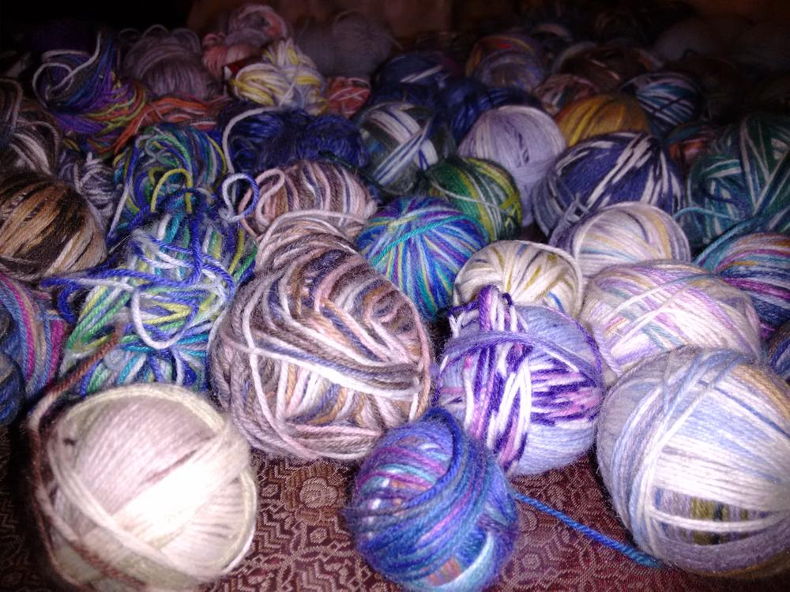

Dazu habe ich mit Nadelstärke 3 vierundzwanzig diagonal gestrickte Patches hergestellt, zusammengenäht und mit zwei Reihen (1 feste Masche, 5 Luftmaschen) umhäkelt.

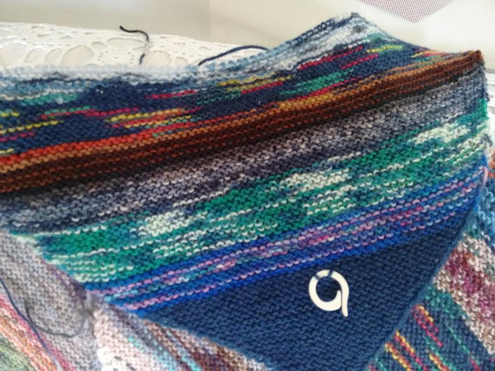

Ein großer Vorteil ist, daß man die Arbeit leicht überall mit hinnehmen kann.

Die einzelnen Teile beginnen mit 3 Anschlagmaschen im Rechtsrippenmuster, wobei in jeder 2. Reihe beidseitig am Rand jeweils eine Masche per Umschlag zugenommen wird. Die Zunahmen habe ich so lange fortgesetzt, bis 99 Maschen auf der Nadel waren. Danach wird dann im gleichen Stil wieder abgenommen, bis auch die letzten 3 Maschen zusammengestrickt sind.

Die Patches sind erst noch etwas rautenförmig, was aber wegen des Rippenmusters durch das Spannen zurechtgezogen wird. Angefangen habe ich immer mit dunklerer Wolle, und bin dann in unterschiedlich breiten Streifen zu den helleren Farben übergegangen. Dadurch entsteht ein zusätzlicher Effekt zu den Diagonalstreifen, die man auf diverse Arten zusammenfügen kann.

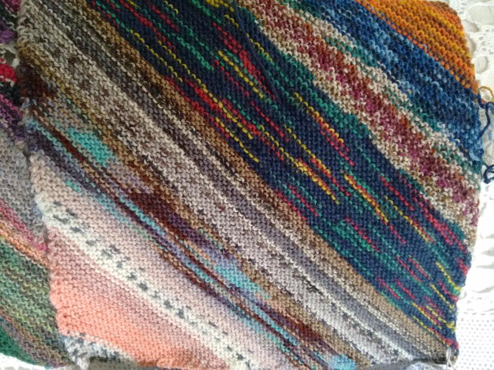

Ich habe sie auf dem Fußboden ausgelegt, und mich sofort für diese Variante entschieden, weil sie mir sehr gut gefällt.

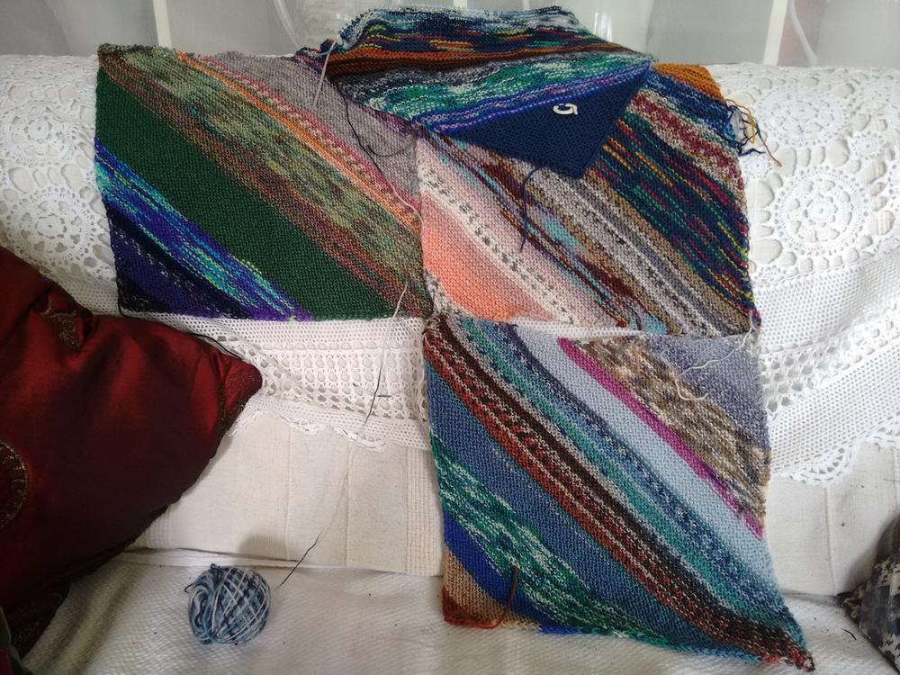
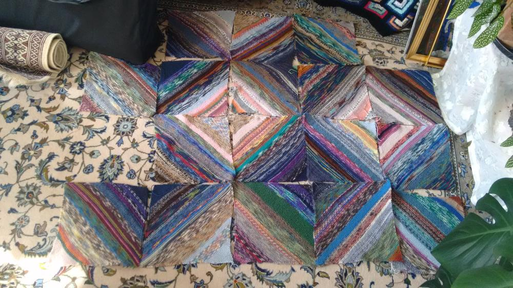
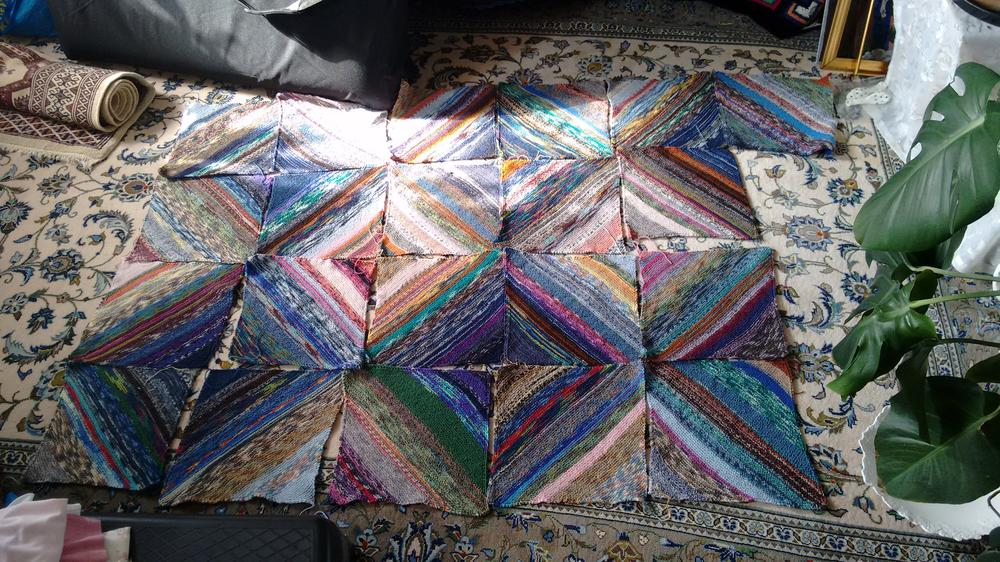
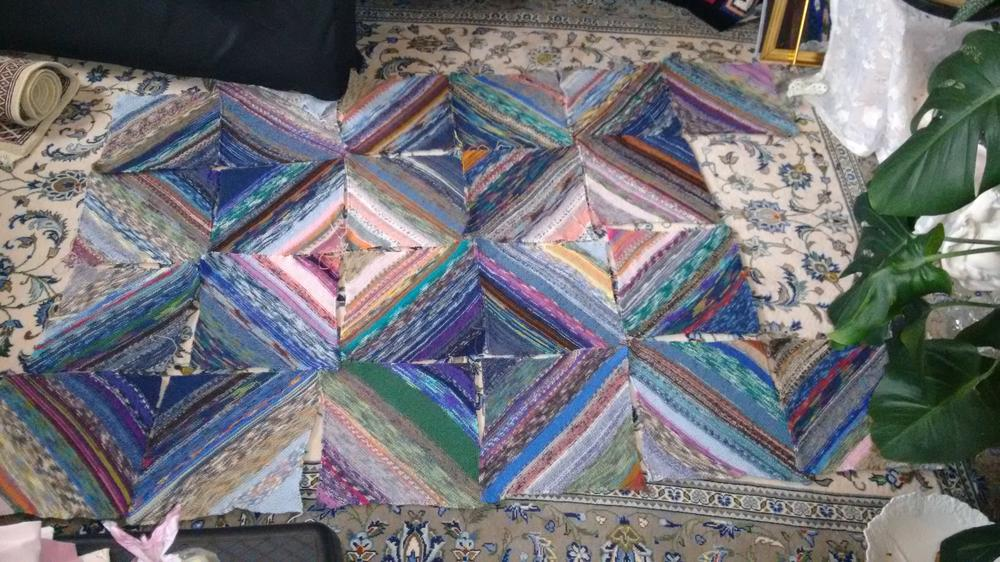

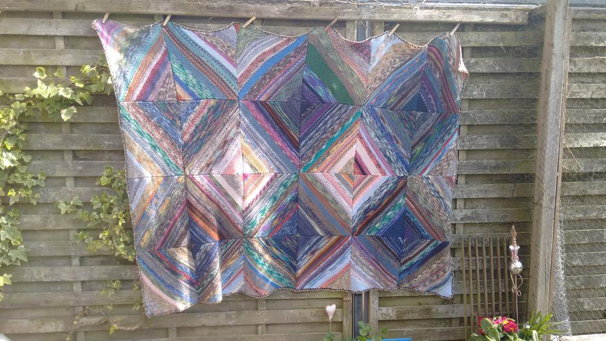

Hier sind noch ein paar Detailaufnahmen.

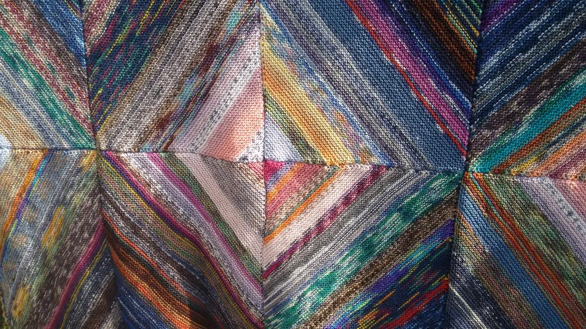

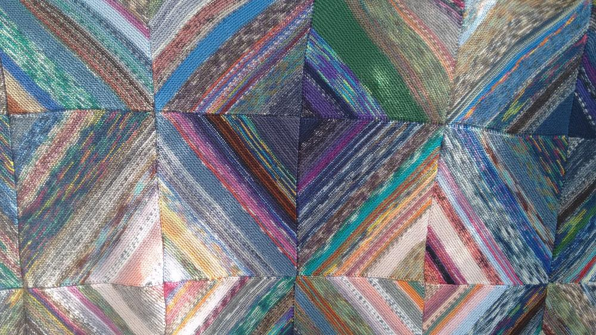
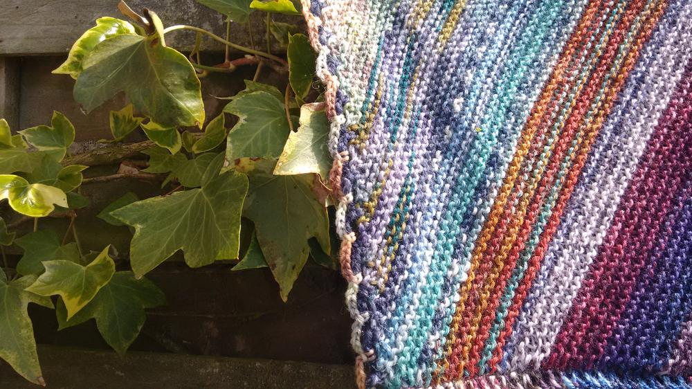
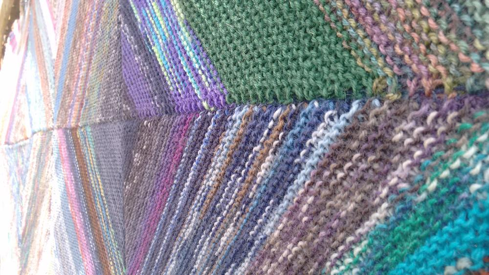
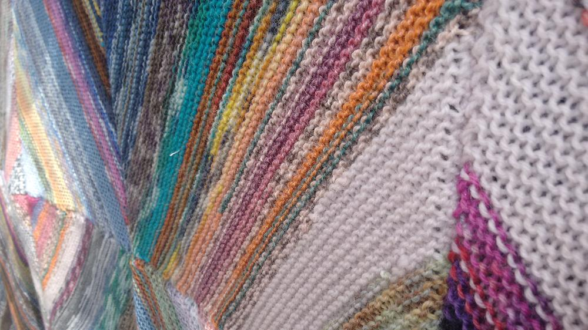
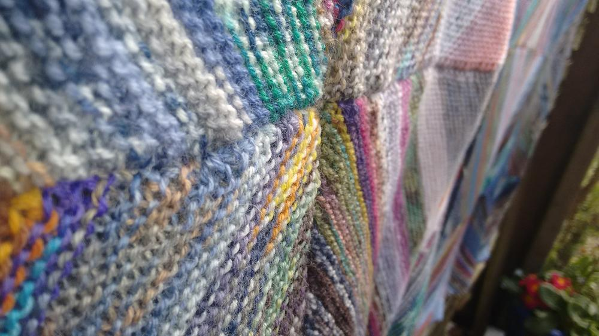
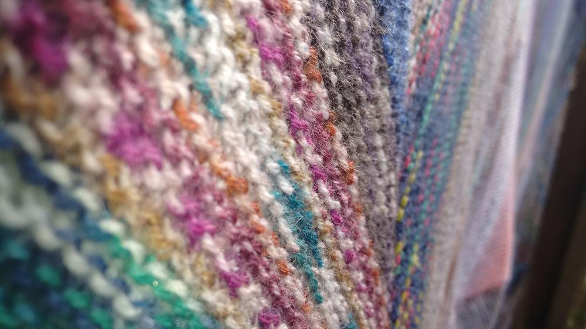
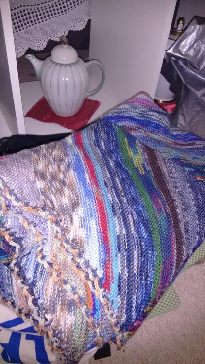

Alles Liebe und eine wunderschöne Woche wünscht euch Lucy.

