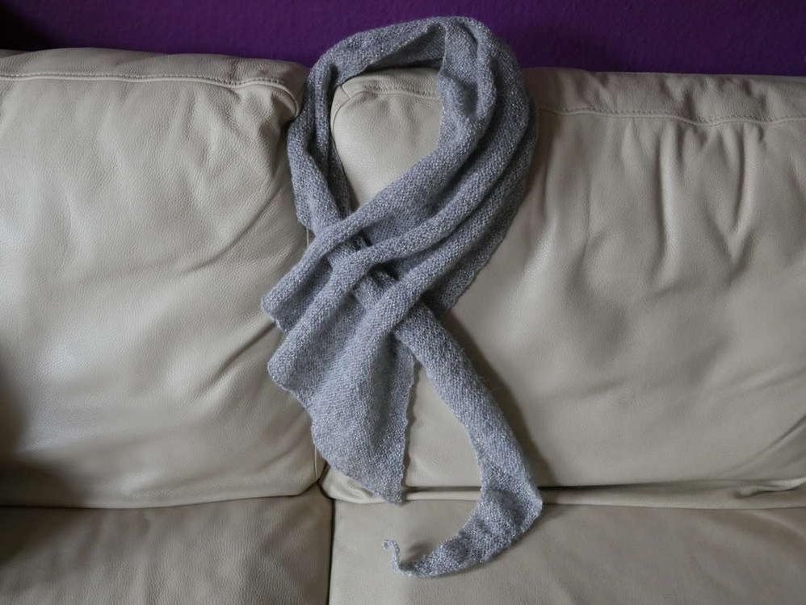
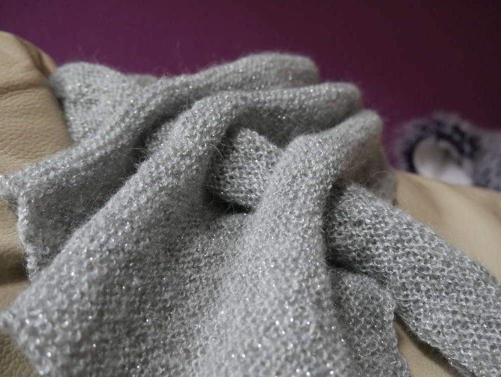
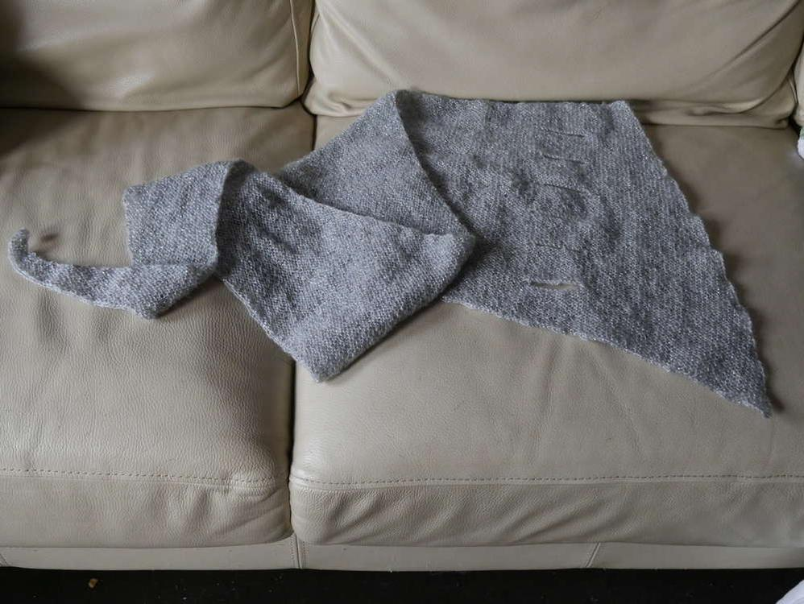
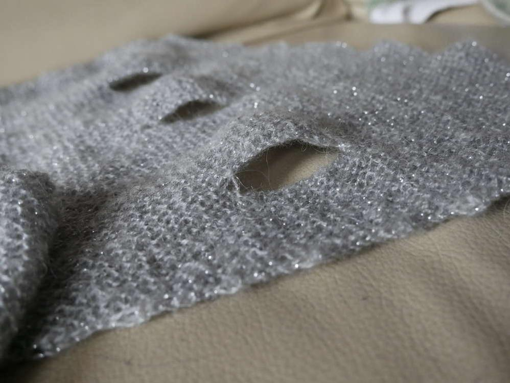

Festlich gestrickt geht's auf Weihnachten zu und ins neue Jahr. Ich habe mich mit Erfolg an der kostenlosen Anleitung von [Alpi's Pfeilraupe](http://alpis-farbenrausch.blogspot.de/p/strickanleitunen.html) versucht, in zartem grau mit glitzerndem Beilauffaden. Die Wolle ist von Woolworth und heißt belday Flauschgarn mit Lurex, auf 100g kommen 650 Meter Lauflänge, ich habe sogar noch etwas Garn nachbehalten. Meine Pfeilraupe ist ein ganz zartes Tuch und sieht mit dem Lurex-Beigarn sehr edel aus und ist somit ein super Acessior für die Bescherung.

Einen schönen 4. Advent und besinnliche Weihnachten wünscht euch Eure Lucy.

