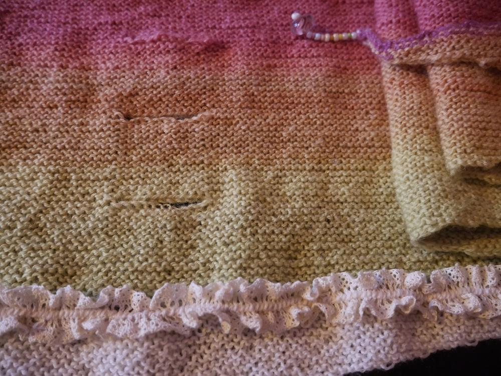

Lucys Pfeilraupe hat mich angesteckt. Nachdem ich an der Anleitung der Pfeilraupe gescheitert bin, hatte ich die Anleitung an Lucy weitergegeben, als dann ihre [Pfeilraupe](/2016/12/pfeilraupe/) erschaffen wurde, fasste ich neuen Mut und wagte mich ein weiteres Mal an die Anleitung, jedoch hielt ich mich diesmal an Lucys Rat die Zählschrift zu nutzen und nicht nach dem Geschriebenen zu gehen. 

Und siehe da, auch meine Pfeilraupe ist sehr ansehnlich geworden. Ich nutzte ein [selbstgesponnenes Garn](/2016/07/never-ending-story-wolle-und-katzen/) mit einer Lauflänge von 413 Metern, nach den Angaben in der Anleitung wären 500-600 Meter erforderlich, was sich auch bei mir zeigte, ich strickte in dem Wissen, das meine Wolle zu kurz war, extra mit Nadelstärke 2,5 statt der angegebenen 3,5 und trotzdem reichte es nicht für die letzten 20 Reihen. Was nun? Weil ich das Tuch endlich fertig haben wollte, suchte ich mir ein Garn der gleichen Dicke und beschloss mit neutraler Farbe zunächst weiterzustricken, denn ein Garn mit dem ähnlichen Grün hatte ich nicht. 
Mir fiel ein: ich hatte noch grüne Spitze, das würde bestimmt toll aussehen, wenn das auf der weißen Wolle festgenäht würde... Irrtum, es war viel zu qietschig, also saß ich 2 Stunden vor meinen Kisten voller Spitzen und Borten und probierte alle Möglichkeiten aus. Nachdem ich dann minimalistischer dachte wurde es immer bessser, so beschränkte ich mich auf eine elastische Borte, die ich an der Übergangsstelle der Garne festnähte. Ich fand in meiner Perlenkiste noch zwei Glasperlen, die ich als Baumler an den Ecken platzierte. 

Nun habe ich eine kleine Pfeilraupe in frühlingsfarben und es sieht schon gar nicht mehr so aus, als hätte das Garn nicht gereicht. Ein schönes, erstes Projekt im neuen Jahr. Und die nächste Pfeilraupe ist schon in Sicht.
