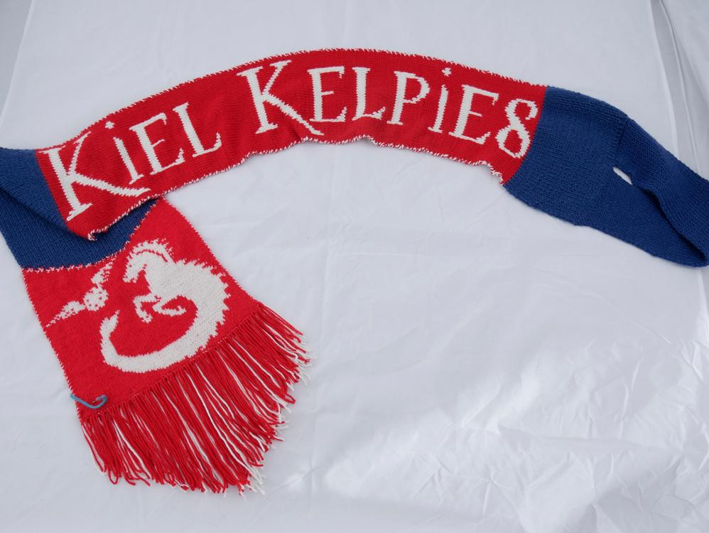
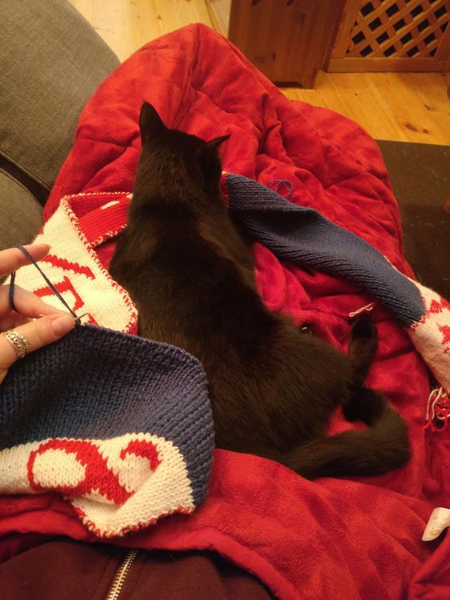
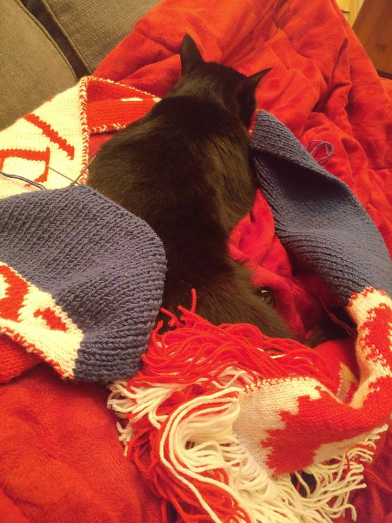
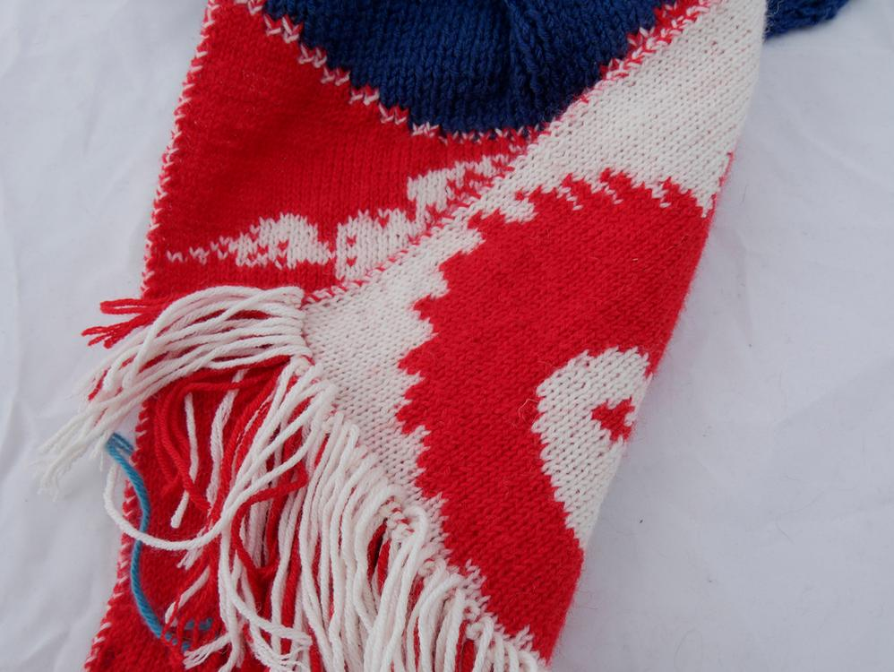
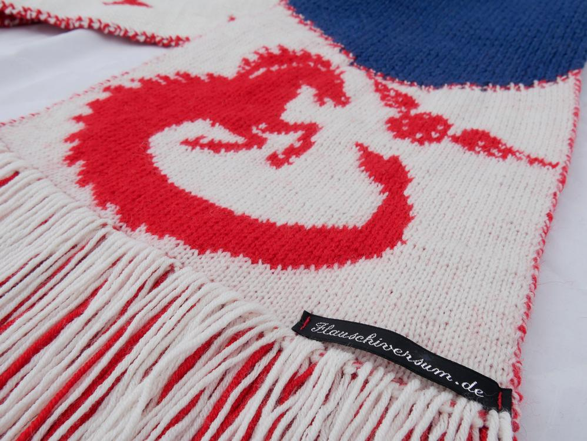
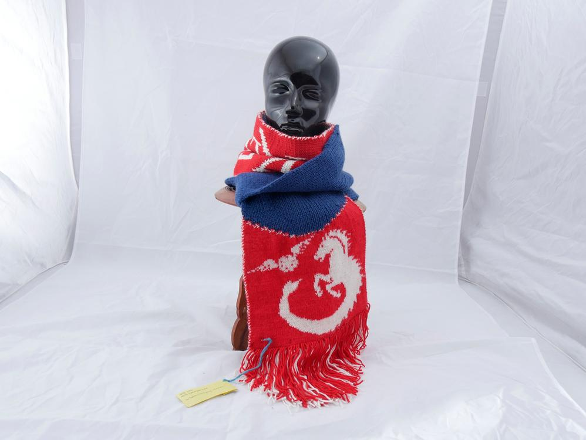

Sei Mitglied in einer Quidditch-Mannschaft, sei lieb zu mir und du bekommst einen Schal zum Geburtstag. So oder so ähnlich hat es ein Kommilitone geschafft mich zu diesem Geschenk zu inspirieren. 

Die Kosten für die Wolle habe ich mir mit anderen Freunden geteilt, gestrickt habe dann ich und zwar wie eine Verrückte, denn der Geburtstag kam schneller näher als mir lieb war. 

Ich habe mich als erstes am Logo der Kiel Kelpies zu schaffen gemacht und mir eine Strickvorlage erstellt. Doppeltstricken dauert auch nahezu doppelt so lange, als würde man es einfach stricken - ist halt doppelt (wie K.L.U.K ich heute wieder bin). Aber das Logo sieht so viel besser aus. Damit das Logo so detailliert sein kann, ist es aus Sockenwolle gestrickt und der restliche Schal später aus doppelt so dicker Wolle. Was für ein Rumgerechne, aber es hat ja ganz gut geklappt. Um mir auch noch Zunahmen zu ersparen, hab ich die Logoform mit den Fransen vollendet.

Auch der Schriftzug ist so viel ansehnlicher, als wenn man auf der Rückseite die Fäden sehen würde. Das Logo zweimal auf beiden Seiten des Schals zu stricken, erschien mir zu wuchtig, darum machte ich aus der blauen Wolle eine Schlaufe, die auch dem Verlieren des Schals vorbeugt. 

Ein unfassbar warmer Schal ist nun entstanden, damit sollte man auch im Winter nach so manchem kalten Training vor Erkältung geschützt sein. 

Aber auch beim Fotografieren hatte ich es wieder nicht so leicht. Irgendwie scheint dieses Fotozelt toll zu sein.

An alle anderen Teammitglieder, die gerne so einen Schal hätten: Eure Begeisterung wurde mir zugetragen und es tut mir leid, aber ich habe leider nicht die Kapazität in Massenproduktion zu gehen, dafür habe ich zu viele Hobbys und switche zwischen diesen zu oft hin und her. Wenn ihr aber die Vorlage haben wollt, damit jemand anders oder ihr selbst euch den Schal strickt, schickt mir gerne eine Email, ich schicke euch dann die Vorlage zu.
