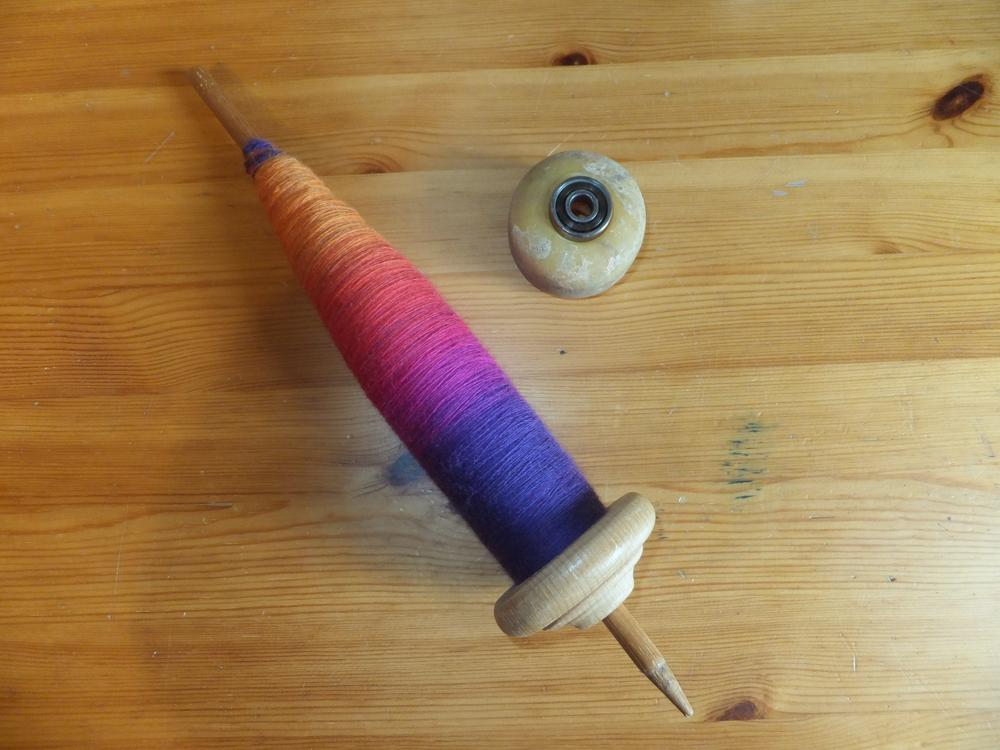
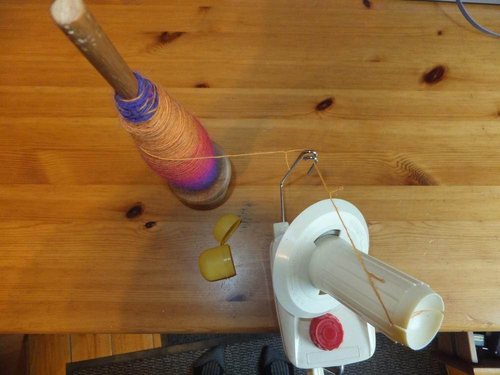
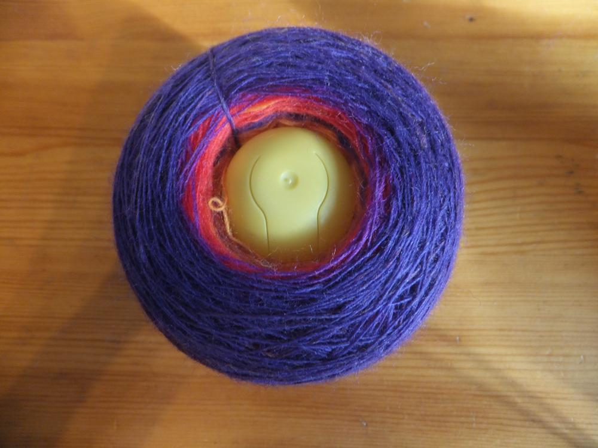

Wenn man Wolle gesponnen hat, kommt das Verzwirnen, aber wie bekommt man die Wolle von der Spindel? Du siehst hier die Wolle, die ich mit der [unterstützten Spindel](/2015/05/unterstutzte-spindel/) gesponnen habe. 

Das Garn ist sehr dünn und ich möchte es, um den Farbverlauf zu erhalten, Navajo-Verzwirnen. Auch zum Abwickeln kann man sehr gut das Skateboard-Rad mit dem Kugellager verwenden. Ich habe einen Wollwickler und mit dem geht das Abwickeln relativ schnell, das Gute an den damit angewickelten Knäulen, man kann sowohl von Innen als auch von Außen den Faden entnehmen, was später beim Stricken praktisch sein kann, wenn es um einen bestimmten Ferbverlauf geht.

Damit mir der innere Faden nicht verlohren geht, habe ich eine neue Verwendung für meine alten Ü-Ei-Hüllen gefunden. In diese kann man den Faden klemmen und beim Abziehen des Knäuls vom Wickler, die Wolle auf das Ei ziehen. 

So ist der Faden auch etwas beschwert, wenn beim Verzwirnen nur noch das kleine Stückchen Wolle übrig ist und es fliegt nicht mehr unkontrolliert herum, außerdem fällt das Knäul nicht in sich zusammen und bildet Knötchen. Jetzt kann das Verzwirnen anfangen und das Ergebnis aus der fertigen Wolle könnt ihr [hier](/2015/07/gut-betucht/) sehen.

