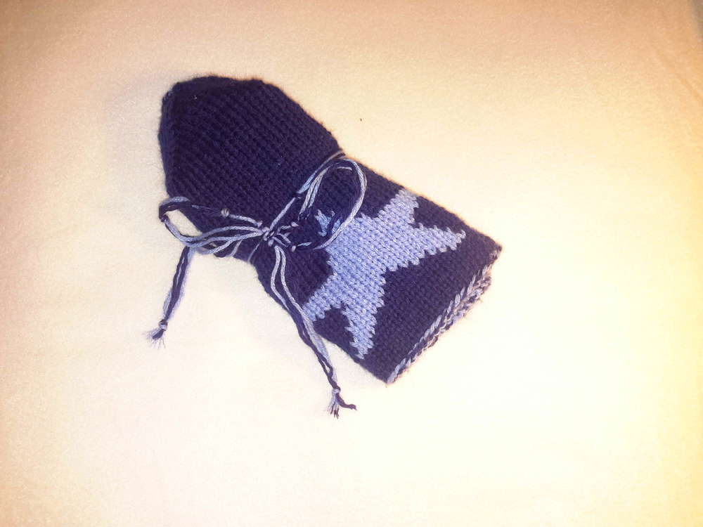
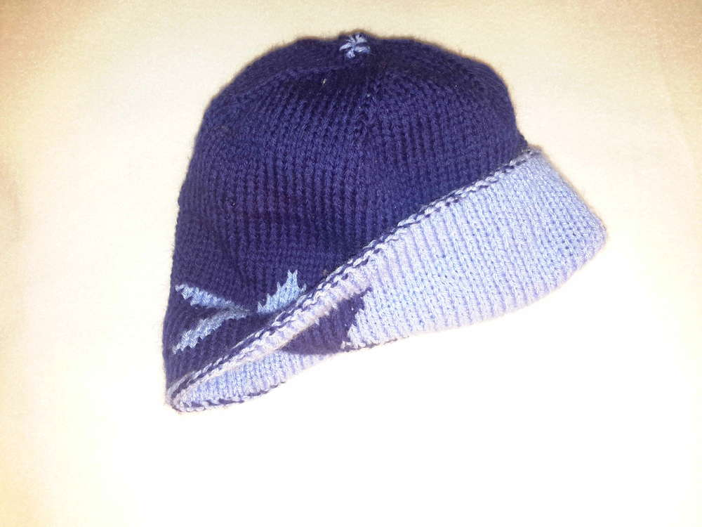
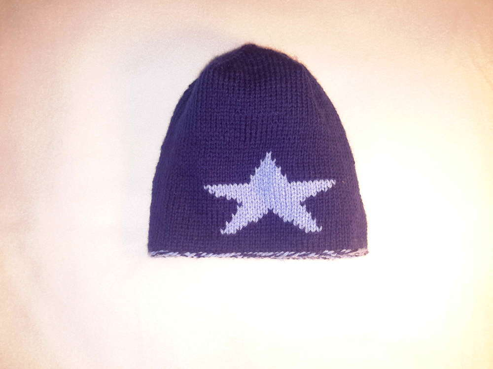
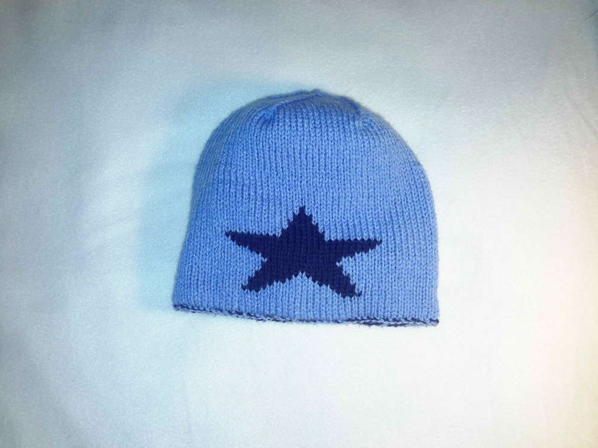
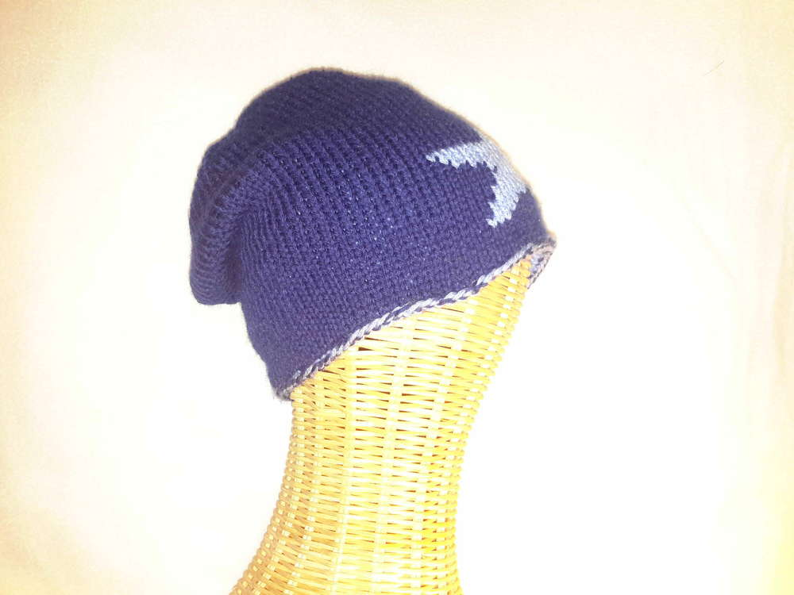
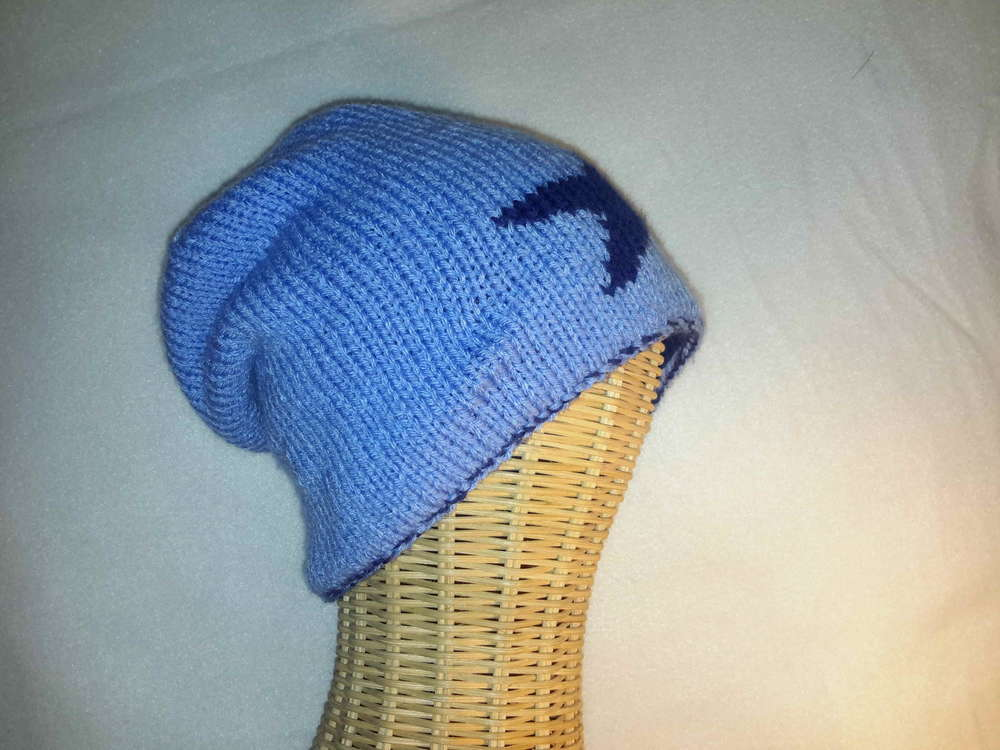
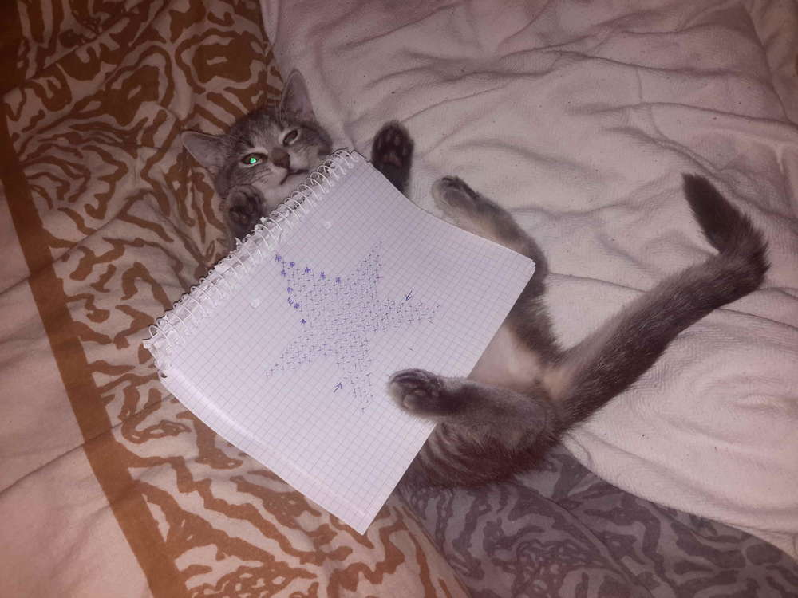
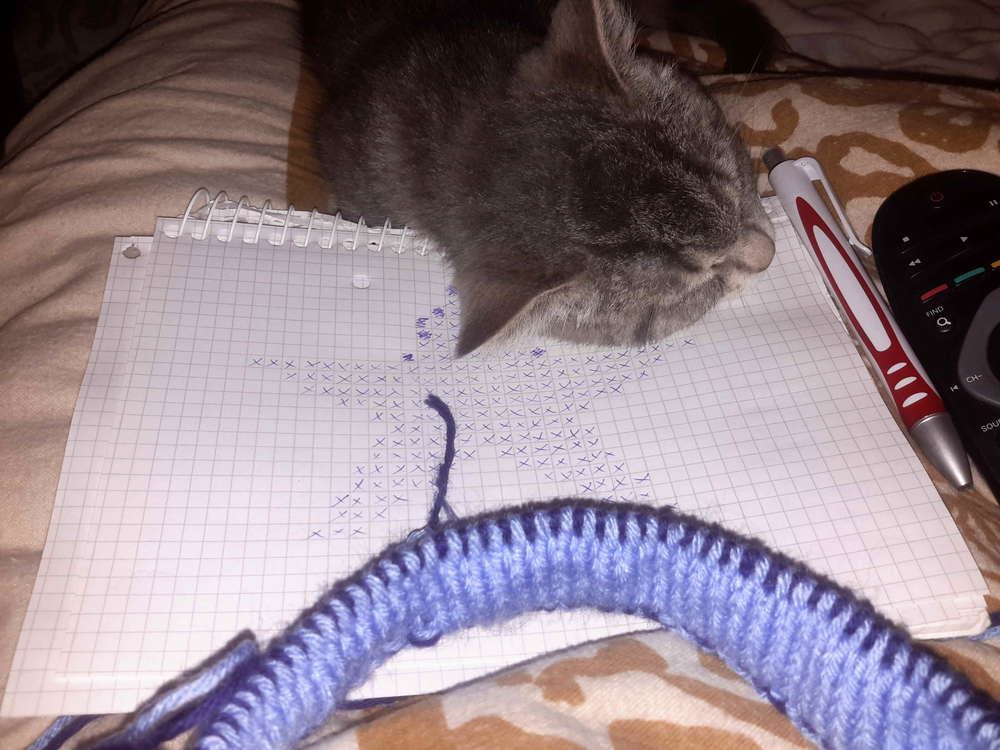

Mit etwas so Einfachem kann man liebe Kollegen glücklich machen. 

Eine Kollegin hatte eine dunkelblaue Mütze mit hellblauem Stern verloren. Sie hing sehr daran. Ich setzte mich daraufhin ein Wochenende hin (ich war eh durch Krankheit ans Bett gefesselt) und strickte ihr eine neue alte Mütze. Da sie meinte die alte Mütze würde um die Ohren etwas ziehen, wenn der Wind steifer weht, entschied ich mich für Doppelstrick. Als witzigen Effekt kann sie die Mütze nun auch wenden. Selten habe ich einen Menschen gekannt, der sich so herzlich über ein Geschenk von mir gefreut hat. 

Eine Herausforderung stellten für mich die späteren Abnahmen dar, da ich noch jeweils abwechelnd die Maschen der inneren und der äußeren Mütze auf der Nadel hatte, da musste ich noch auf zwei Nadeln umswitchen und erst die innere Mütze fertig stricken, ehe ich das Projekt beenden konnte. 
Mit Jemimas tatkräftiger Unterstützung habe ich für diese Mütze nur doppelt so lange gebraucht wie ich normalerweise benötigt hätte. Sie war zum einen der Meinung sie müsse meine Strickvorlage immer neu ausrichten und das Knäul vorsorglich abwickeln und auf Knoten überprüfen (scheinbar waren ihr noch nicht genug Knoten vorhanden) und zum anderen war mein ganzes Handarbeitsensemble so bequem, dass sie stundenlang darauf schlummerte. 

An dieser Stelle einen schönen dritten Advent, viel Gesundheit und Liebe, Eure Ermeline.
