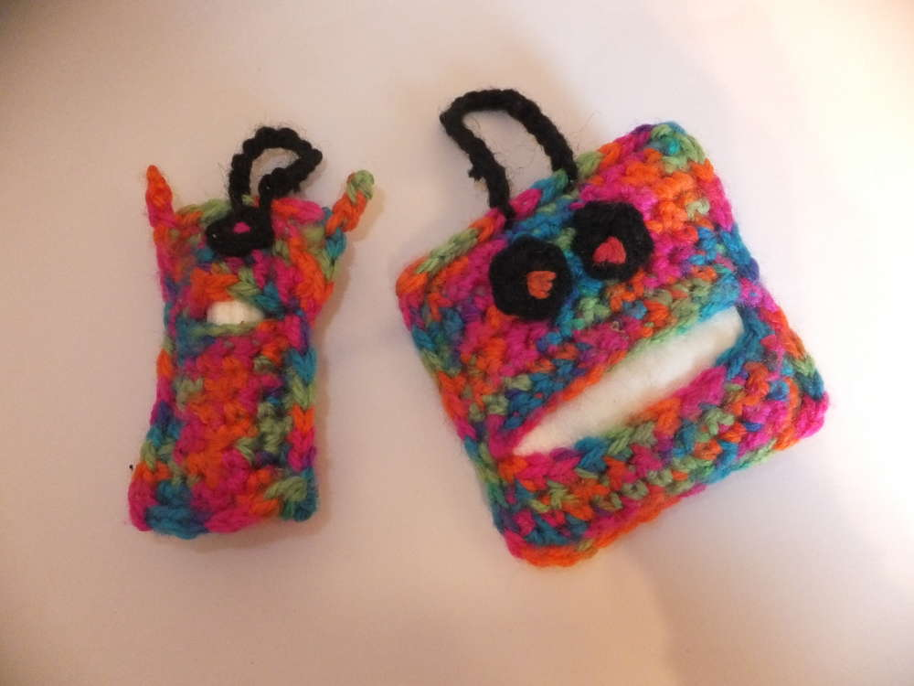
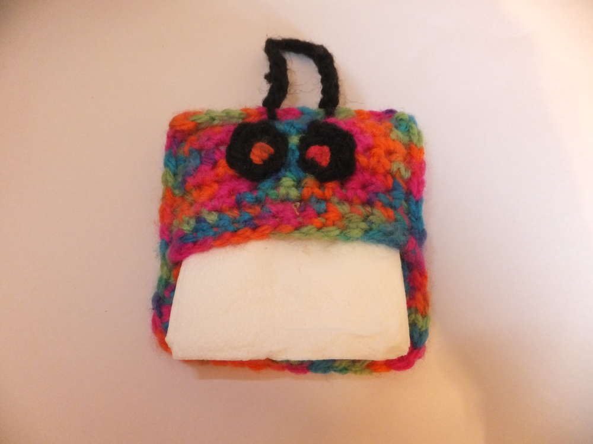
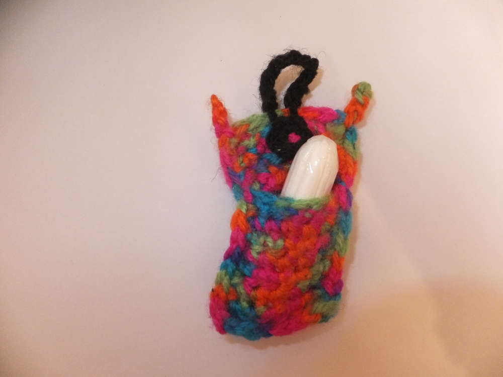
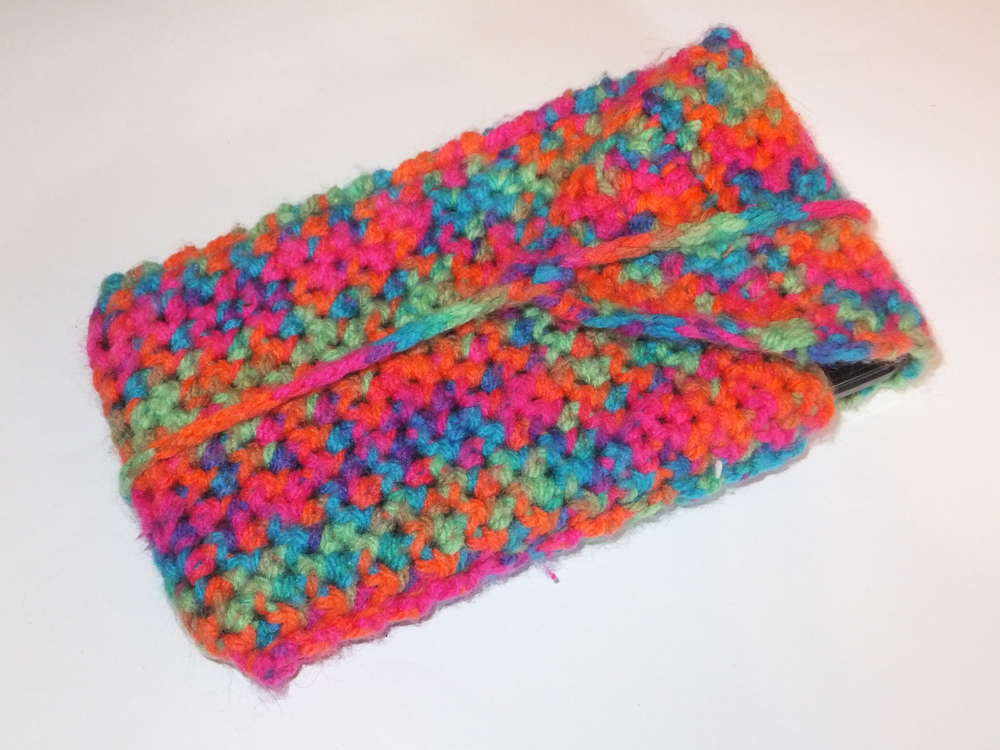
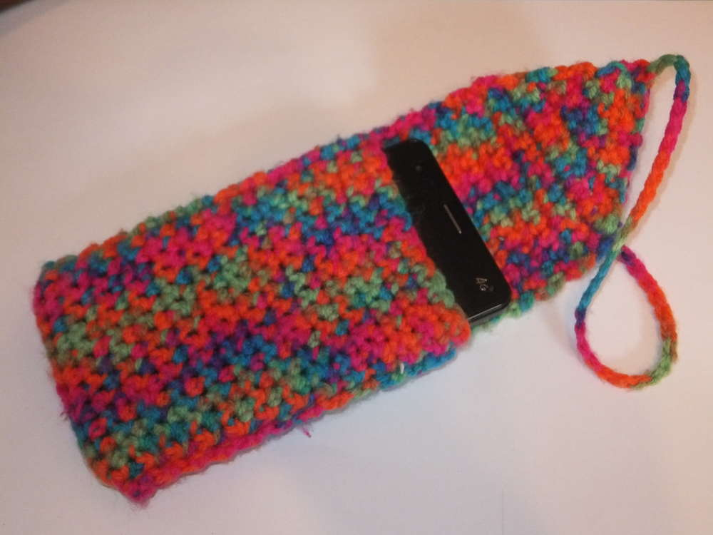

Es macht sich bemerkbar, dass ich ferienreif bin. Trotz eines Tiefpunkts in meinem kreativen Wirken, beschränkt sich dieser lediglich auf die großen Beklopptheiten, die ich sonst fabriziere. Es sind die kleinen Dinge die mich derzeit zufriedenstellen, so habe ich bei Pinterest ein Tamponmonster gefunden und musste es gleich nachhäkeln. Die Anleitung findet ihr bei [lisibloggt](https://lisibloggt.wordpress.com/2015/09/29/anleitung-tampon-monster-haekeln/).
Bei dem großen Monster fallen bei mir die Tampons raus, sobald einer weg ist, ich habe also einen eizelnen Tamponwächter gehäkelt und in dem großen Monster zwei Notfalltaschentücher deponiert, die ich auf dem heutigen Flohmarkt gut hätte gebrauchen können.

Aus der gleichen Wolle ist an einem Abend eine neue Handytasche entstanden.

