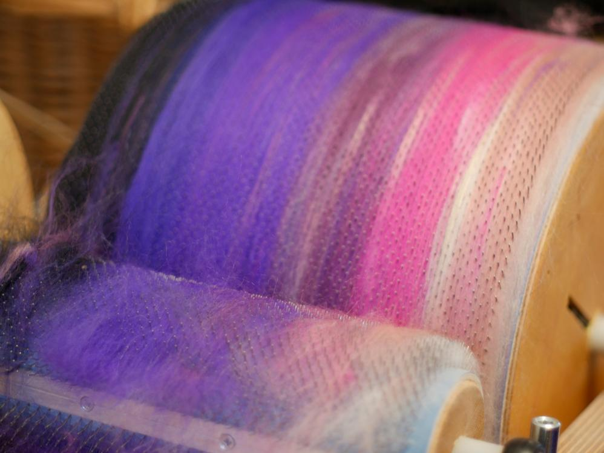
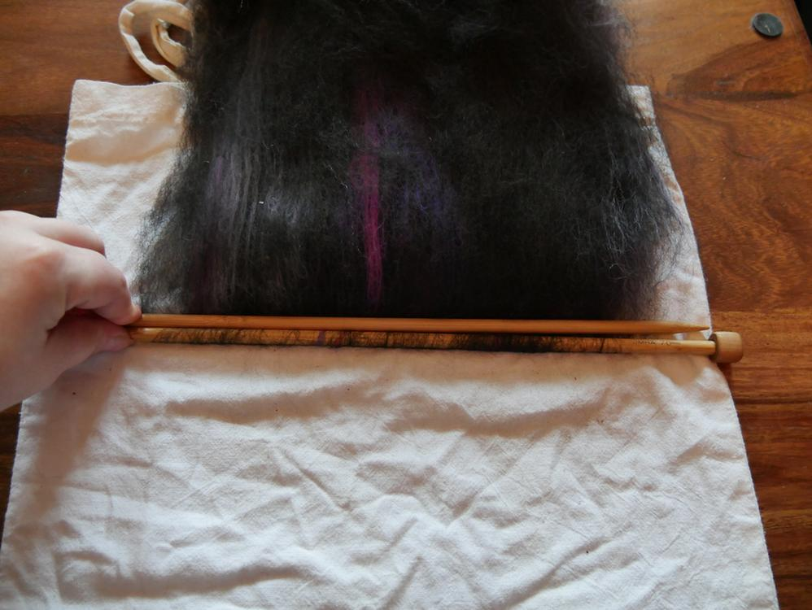
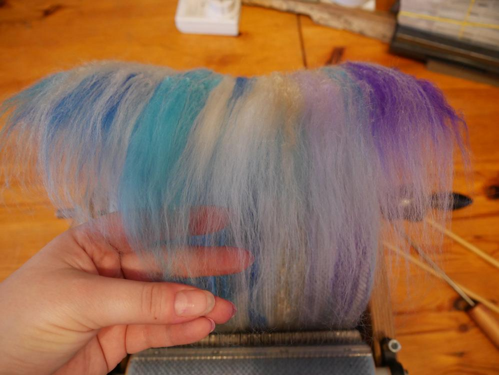
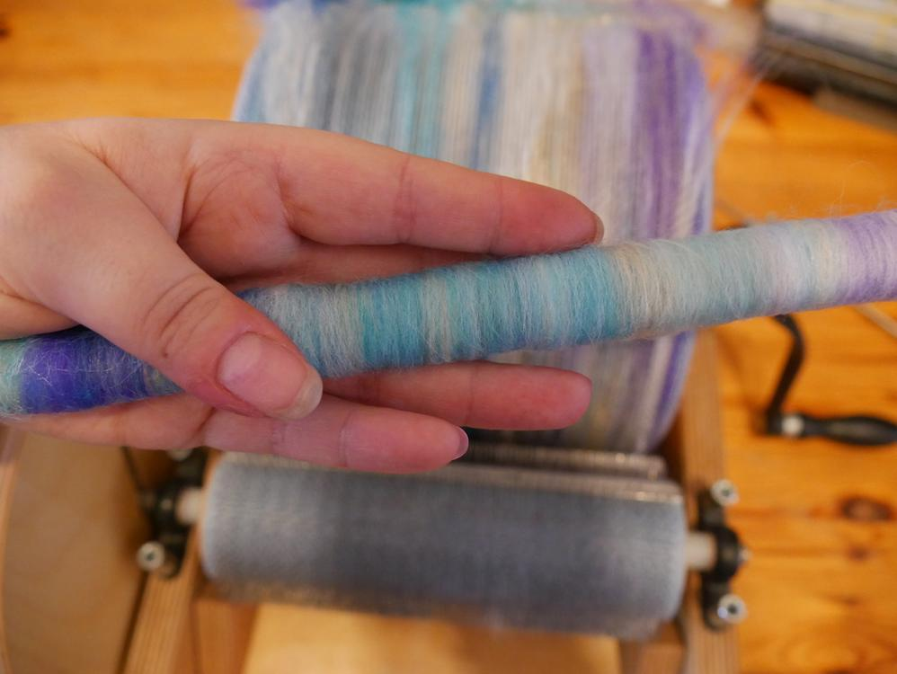
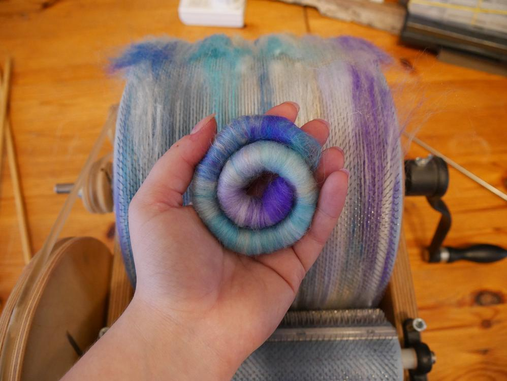
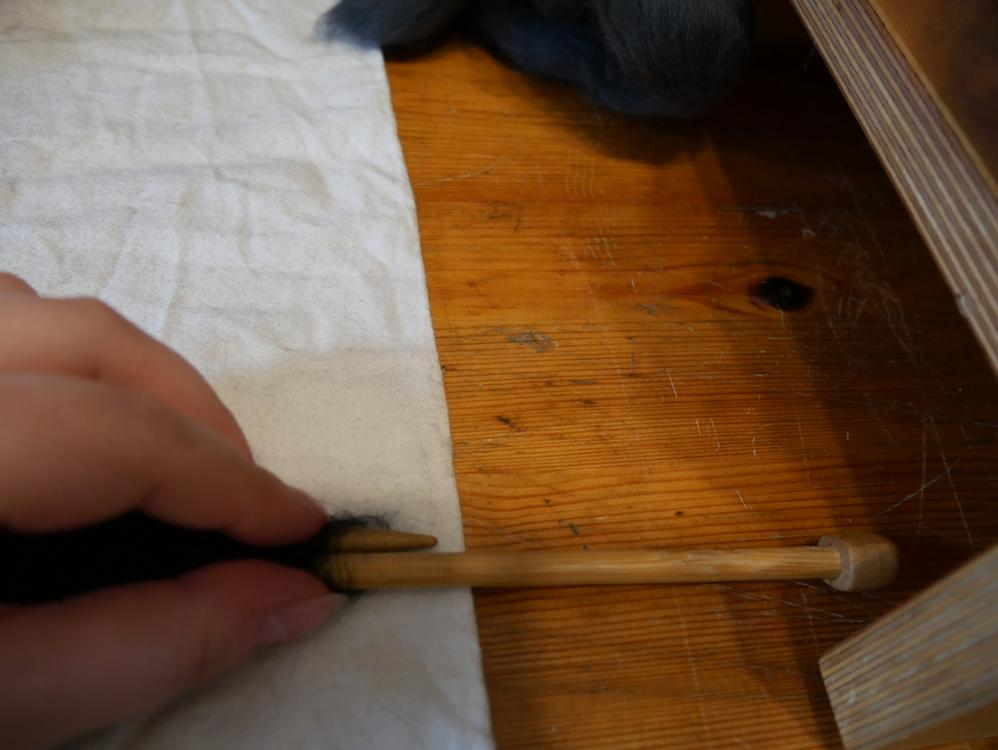
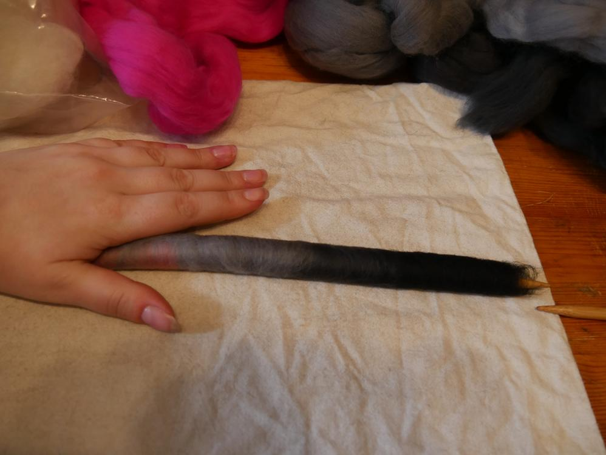

Es gibt viele Möglichkeiten die Wolle zum Spinnen vorzubereiten. Du kannst direkt aus der Flocke spinnen, und Kammzüge kaufen und auch Vliese verarbeiten, ich zeige hier was man alles Zuhause mit Kardiergerät und ohne machen kann. Die letzten Wochen habe ich mich sehr intensiv dem Spinnen und besonders dem Vorbereiten der Fasern gewidmet und was ich für Möglichkeiten gefunden habe sich auszutoben, will ich euch nicht vorenthalten. Zunächst ein Paar Basisinfos um dann fließend in meine Experimene überzugehen. Die hier genannten Möglichkeiten und Techniken sind von mir selbst erprobt und für mich für gut befunden, was aber nicht heißt, dass es nicht bessere und vielfältigere Varianten und Techniken gibt, ich will hier einfach mal alle mir bekannten Vorbereitungsmöglichkeiten zusammenbringen.

## aus der Flocke spinnen

Hierbei nimmst du die gewaschene oder ungewaschene Wolle vom Schaf oder anderen Wollspender, manchmal ist sie schon gefärbt aber hat sonst noch keine weitere Vorbereitung erfahren. Diese Fasern spinnst du quasi direkt vom Schaf.

## kardieren oder kämmen

Kardieren ist nach dem Waschen und Färben die nächste Stufe der Vorbereitung zum Spinnen. Nachdem die Wolle per Hand oder mit einer Flickkarde (ich verwende einen Hundekamm) von groben Unreinheiten befreit wurde, kardiert oder kämmt man sie. Die Wolle wird dabei von kleineren Unreinheiten befreit und aufgelockert. Dies kann mit einem Kamm, Handkarden oder auch einer Kardiermaschine geschehen. Bei dieser Arbeit werden die Wollfasern, die in der Flocke noch sehr wirr durcheinander liegen, in die gleiche Richtung gekämmt, dies vereinfacht später das Ausziehen der Fasern und man schafft damit einen gleichmäßigeren und fluffigeren Faden. 

Ich habe mir dafür vor Jahren meinen Rudy angeschafft. Meißt mische ich mir dort meine Kammzüge in neuen Farbkombinationen an. 

## Vlies

Das Vlies ist die kardierte Wolle, die man von der Trommelkarde abziehen kann. Man kann dieses sehr gut in Streifen trennen und dann verspinnen. 

## Kammzug oder Kardenband

Der Kammzug ist, wie der Name schon sagt, ein vom Kamm durch einen Diz gezogenes Wollband. Dieses kann man aber auch sehr gut mit dem Kardiergerät machen, du erhälst dann ein Kardenband. Ich nutze dies um mir lange sanfte Farbverläufe zu erschaffen. Wie zum Beispiel dieses Galaxygarn.

Dafür trenne ich nur einen kleinen Teil am Anfang des Vlieses von der Trommel und ziehe sie duch einen Diz, es reicht ein Gegenstand mit einem Loch durch den die Fasern durchgezogen werden können. Auch Perlen oder Ähnliches, jedoch sollte man den Diz gut festhalten können.

Wenn zu viele Fasern durch das Loch gezogen werden, muss man wieder vorsichtig etwas ausziehen und kann dann weiterarbeiten. Es erfordert etwas Übung, mit etwas Feingefühl und Geduld findet man aber die richtige Menge an Wolle, die man durch den Diz ziehen kann. Der Vorteil beim Ziehen durch den Diz ist, sowohl das ungefähr ein gleichmäßig dickes Band entsteht, als auch dass sich die Fasern im Band etwas verdichten. Das fertige Band häkel ich dann zu einem Zopf, so kann ich ihn leichter aufbewahren.

Ist einem das Band noch zu dick, kann es mittels Ziehen durch ein kleineres Loch ausgedünnt und somit auch verlängert werden, dafür zieht man vorsichtig das Band am Diz aus bis es wieder durch das Loch passt. Ich habe es hier mit dem Galaxyband gemacht, es war mir noch zu dick. Hier sieht man, dass ich das Nadelmaß für meine Stricknadeln genommen habe.

Achtet darauf, dass nicht zu viel Kraft aufgewandt wird, da diese Hilfsmittel meißt aus Plastik sind und leicht brechen könnten wenn man zu dicke Wollbänder hindurchziehen will. Ändert lieber langsam die Lochgröße und dünnt es dafür öfter aus.

## Rolags oder Fauxlags

Rolags sind gewickelte, vorher gekämmte Wollfasern, die kleinen 'Würstchen' haben sehr viel Wolle in sich und sind zugleich sehr kompakt. Man kann sie zum Spinnen ausziehen und damit schon ein Vorgarn erzeugen, durch die Wicklung sind die Fasern schon minimal vorgedreht. Sie sind besonders gut geeignet um Unterwegs mit der Handspindel versponnen zu werden. Man kann mit ihnen ein sehr dünnes Garn spinnen und auch wiederkehrende regelmäßige Farbverläufe können sehr gut umgesetzt werden.

Fauxlags (auch Faux-Rolags) werden die 'Würstchen' genannt, die nicht mit Handkarden gemacht werden. Also sind per Definition die von mir gewickelten Rolags eigentlich alle nur Fauxlags. Es steckt aber das gleiche Prinzip dahinter, darum nenne ich sie weiterhin Rolags.

## Rolags ohne Kardiergerät aus dem Vlies

Ich zeige euch hier, wie man Rolags aus einem Vlies wickeln kann, welches schon von der Trommel gelöst wurde. Dies ist auch für jene Interessant, die vielleicht ein gekauftes Vlies Zuhause haben und selbst kein Kardiergerät. Die auf diese Weise gedrehten Rolags werden nicht ganz so kompakt und gleichmäßig wie jene aus dem Kardiergerät direkt aber auch sie helfen dabei die Wolle kompakter lagern zu können und sind wesentlich handlicher als das gesamte Vlies. 

Dies ist das Vlies, das ich oben von meinem Rudy habe kardieren lassen. Da es schon von der Trommel getrennt ist, ist es sehr aufgeflufft und nimmt viel Platz ein, um hieraus Rolags zu drehen muss ich das Vlies halbieren.

Als nächstes habe ich mir ein Paar meiner dicksten Stricknadeln genommen, vozugsweise Holz, da diese etwas mehr Haftung haben. Meine Nadeln haben 7mm Durchmesser. Um mir das Rollen zu erleichtern habe ich mir auch wegen der Haftung ein Tuch untergelegt. Die eine Vlieshälfte wird zur Seite gelegt, während ich nun meine ersten Fauxlags drehe.

Ich klemme dafür die ersten Fasern zwischen die zwei Nadeln (achtet darauf, dass die Enden auf gegenüberliegenden Seiten sind, das erleichtert später das Herausziehen der Nadeln) und wickle den Anfang des Vlieses auf.

Die eingeklemmten Fasern sollte man nun etwas ausziehen und wieder aufwickeln, ich lege dafür meinen Arm auf das Vlies und ziehe vorsichtig mit der anderen Hand an den Stricknadeln. Wenn genug aufgewickelt ist, dann zieht man die Rolle mitsamt Nadeln vom Vlies ab und streicht mit der Hand vorsichtig die herausstehenden Fadern an der Rolle fest.

Nun zieht man die erste Nadel heraus, halte dabei den Rolag noch mit der anderen Nadel zusammen fest. Ziehst du beide Nadeln gleichzeitig heraus, ziehst du unter Umständen den Rolag auseinander und er reißt eventuell.

Nun kann man die Fasern aus dem Rolag vorziehen und verspinnen.

##  Rolags mit Kardiergerät

Für jene, die ein Kardiergerät haben, so ziehe ich meine Rolags direkt vom Kardiergerät.
Ich habe mir hierfür eine fröhliche Merino-Meerjungfrauen-Mischung gemacht mit Seidenfasern. Ich lege nicht so viele Fasern auf die Trommel, wie ich es bei meinen Kammzügen mache, meiner Meinung nach erleichtert mir das das Fasernausziehen.

Ich lasse beim Mischen die Einzugsrolle aus und halte die Kammzüge direkt auf die Trommel, sie sind ja schon gekämmt.

Nun wickelt man die Rolags wie auch schon beschrieben beim Rolagsdrehen aus dem Vlies. Nur wird hier mehr darauf geachtet, sich immer nur ein Paar Fasern auszuziehen und diese aufzuwickeln. Ich selbst finde es noch etwas frickelig mit den Daumen die Trommel zu fixieren, während ich mit den anderen Fingern die Nadeln halte, Fasern ausziehe und wickle. Aber Übung macht auch hier den Meister oder ein Helferlein das die Trommel fixiert.

Meine Ausbeute ist zufriedenstellend, ich schaffe mit einer Trommel so 10 bis 12 Rolags, im Vergleich zu den aus dem Kammzug gewickelten sieht man auch, dass sie wesentlich komprimierter sind.

## Punis 

Punis sind ähnlich wie Rolags, nur dass sie für die Vorbereitung kurzer Fasern gedacht sind, wie zum Beispiel Baumwolle. Sie enthalten weniger Fasern als ein Rolag und sind in der Regel noch komprimierter, weil sie nachgerollt werden sobald die erste Nadel gezogen wurde. Bei Wolle würde ich aber auf zu starkes Nachrollen verzichten, da Wolle zum Filzen neigt. Deshalb sind meine Merino-Punis sehr fluffig und luftig. Ich habe hier Punis gedreht, aus Kammzugfasern, einfach weil ich es mal ausprobieren wollte, auch hier ist das Spinnen von Lacegarnen sehr einfach. Und diese Vorbereitung kann man super umsetzen, wenn man keine faservorbereitenden Hilfsmittel wie Kamm oder Kardiergerät hat. Es ist auch eine Gute Variante der Vorbereitung, die mit gewaschenen Wollflocken umsetzbar ist, wenn diese vorher  per Hand aufgeflufft wurden.  

Ich habe mir wieder ein Tuch untergelegt und meine beiden Stricknadeln rausgesucht.

Ich habe mir meine Fasern in der gewünschten Reihenfolge ausgezogen und nebeneinander ausgelegt. 

Und dann wird gewickelt wie auch bei den Rolags, nur ohne das Ausziehen der Fasern, denn hier liegt ja immer nur ein Auszug.

Ich habe vor ein Lacegarn zu spinnen, wo ein wiederkehrender Farbverlauf gewünscht ist, ich wechsle hier zwischen schwarz-grau-rosa und schwarz-grau-lila.

Es war ein lehrreicher und flauschiger Tag für mich. Ich hoffe ich kann hier ein wenig von meinem Erlernten weitergeben. Die Ergebnisse machen mir Lust auf Spinnen. Ich merke an solchen Projekten und Ideen immer wieder, dass ich gerne mindestens ein Paar mehr Hände hätte oder einen Zwilling mit der gleichen Begeisterung für Handarbeiten. 

Schickt mir gerne eine E-Mail mit euren Versuchen oder Tipps, ich stehe ja auch noch am Anfang und freue mich über Anregungen.  
Möge der Sonntag nur so dahinflauschen und -rollen, viele kreative Ergüsse wünscht euch Eure Ermeline!!

