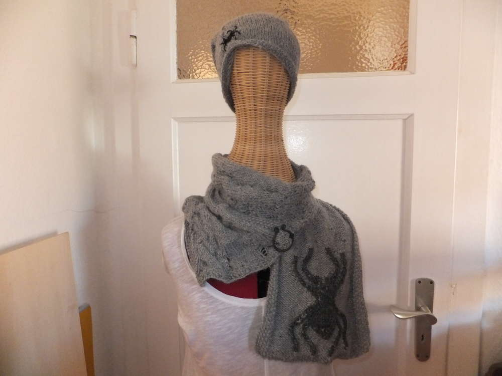

Es kann jederzeit kalt werden in Schleswig Holstein, ich bin für jede Abstufung von 'dat büsschen Wind' gewappnet. Ein weiteres Projekt ist beendet und das nehme ich mal zum Anlass all meine selbstgemachten Schals und Tücher, die ich euch noch nicht gezeigt habe, zu dokumentieren.

Nachdem ich den [Autumn Shawl](/2016/09/autumn-shawl/) beendet habe, drängte mich ein weiteres Projekt zur Dezimierung meiner Wollbestände. So suchte ich mir die dickste Wolle aus meinem [Wollfass](/2016/04/das-wollfass/), was sich als die vier Käul Maxima von LangYarns heraus stellte, kombiniert mit 2 Knäulen LangYarns Arenas in einer ähnlichen Farbgebung kam dieses unfassbar warme Urgetüm heraus. Gestrickt habe ich mit zwei Stöcken, da ich keine so dicken Nadeln hatte und auch keine kaufen wollte. Es wurde immer in rechts-links-Maschen gestrickt, die versetzt zu diesem Noppenmuster führen. 

Auch dem Virustuch bin ich zum Opfer gefallen, die Anleitung findet ihr bei Ravelry. Mit einer großen Häkelnadel und dicker Wolle wird dies zu einem wärmenden und trotzdem luftigen Tuch. 

Der 'October is for Spinner' wurde von mir zwei mal gestrickt. Dies ist die erste Variante, gestrickt mit LangYarns Tosca Light. Ich hatte verschiedene Farbpartien, was sich im Nachhinein als sehr angenehme Kombination herausstellte - zum Glück. Auch diese Anleitung ist zu finden bei Ravelry, ich hoffe für euch, dass ihr eine überarbeitete Version bekommt, bis ich den Fehler gefunden habe, der dafür sorgte, dass die Löcher nicht da waren, wo sie hingehörten. Dadurch, dass man bei diesem Schal immer dickere Nadeln nimmt und die Wolle zudem dünner wird, hat man ein regelrechtes Ungleichgewicht, damit der Schal mir nicht ständig verrutscht, benutze ich eine Fibel. Diese habe ich von einem Mittelalter-Markt.

Beim zweiten 'October is for Spinner' habe ich mit nur einem Faden gestrickt und bis auf die Spinne sehr viel selbst improvisiert. Das Schöne dabei, es ist egal was man macht, irgendwie passt das schon. Da kann man Zopfen, Löchern, Fallmaschen und was das Herz sonst noch begehrt ausprobieren. Passend dazu entstand auch eine Beanie-Mütze mit aufgestickter Spinne. Leider kratzt die Wolle, ich werde mir also noch etwas wie ein Innenfutter einfallen lassen müssen. Die Spinne habe ich diesmal nochfarblich abgesetzt, indem ich mit dunklerem Grau nochmal alles Nachgestickt habe.

Ein simpler Loop aus einem Knäul Wolle ist dieser hier, er wird einfach um den Hals gelegt, hält aber effektiv warm.

Am Armstricken habe ich mich auch mal versucht, dabei kam aus ebenfalls einem Knäul Wolle, dieses luftig leichte Netzchen heraus. Diesen Loop verzwirbel ich gerne zweimal und lege ihn mir dann um den Hals. 

Einer meiner ersten gestrickten Schalputzen ist dieses bunte Zipfelchen. Ich weiß noch, dass es an einem Samstag mitten in der Nacht entstanden sein muss, denn morgens um 7.00 Uhr weckte meine Mutti mich für den sonntäglichen Flohmarkt und ich hatte die ganze Nacht durchgestrickt um den Schal fertig zu bekommen. Damals tat ich mich noch schwer mit Maschenabnahmen. 

Mein erster Besuch im Idee Kreativ Markt dürfte einige ehemalige Kollegen aus dem Kieler Grusellabyrinth zum Schmunzeln bringen wenn sie sich daran erinnern. Wir waren in Berlin zum Tanz der Vampire und - jetzt kann ich es ja sagen - ich hatte die Schule geschwänzt - pfui (es hat sich gelohnt). Wir schlenderten über den Ku-Damm auf der Suche nach dem hässlichsten Schuh (wir wurden fündig). Nach langem Quengeln ließen sich meine (ausschließlich männlichen) Begleiter dazu hinreißen in diesen tollen bunten Bastelladen mit mir zugehen. Nun muss ich sagen, der Idee-Markt in Berlin ist um einiges größer als unserer in Kiel. Ich war platt und erschlagen, von Stoffen und der Wolle. Sowas hatte ich noch nicht gesehen. Entlang des Wollregals wurden meine Augen immer feuchter und ich stand mit Freudentränen in den Augen mitten im Laden und wurde von meinen äußerst überraschten fröhlichen Begleitern in meinem schwachen Moment abgelichtet. Im Übrigen trage ich auf dem Bild den 'October ist for Spinner', die [Mützekatze](/2014/05/mutzekatze/) und die [Bender-Tasche](/2014/01/taschen-aufhubschen/)

Zum Schluss entschied ich mich für ein riesiges Knäul Wolle (mindestens so groß wie mein Kopf) und nahm es mit. Daraus wurde dieser Monsterloop, den man Notfalls auch als Schlafsack benutzen könnte. :D

Dieser Schulterüberwurf kann als solcher getragen werden, ich kombiniere ihn jedoch gerne mit einer Looputze. Der Überwurf ist gestrickt mit verkürzten Reihen. Die Looputze ist aus einfachem, sehr weichem, schwarzen Garn und sorgt in Kombination mit dem Überwurf für einen angenehm warmen Hals, da kommt kein Lüftchen durch und der Rücken ist warm.

Ich merke selbst gerade, dass das echt viele Tücher, Schals und sondergleichen sind. Dabei waren das ja noch nichtmal alle... ein Ende ist auch noch nicht in Sicht, in diesem Sinne einen wolligen Sonntag, Eure Ermeline.
