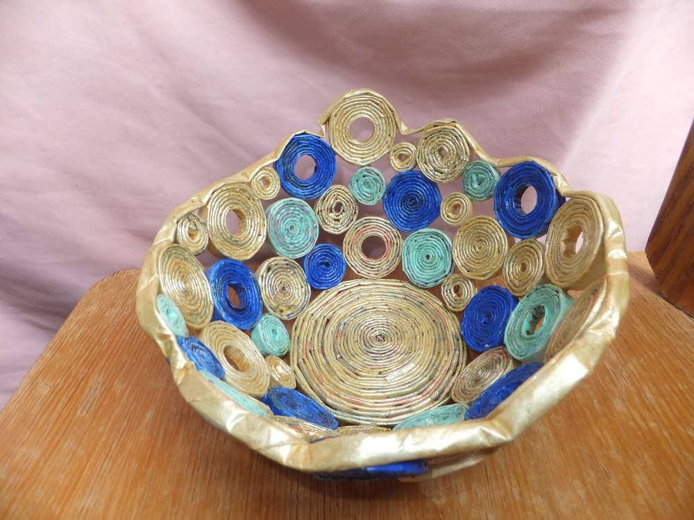
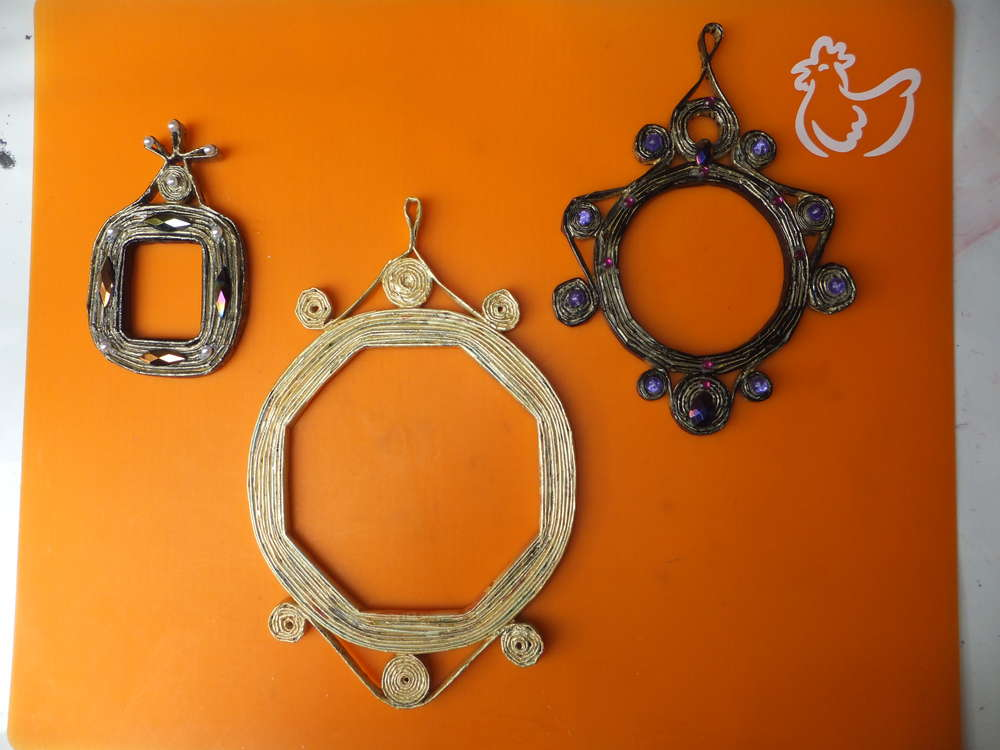

Das mir hier bloß keiner die Rentner-Bravo belächelt! Ich habe mit ihr soooo viel Spaß, weil da ganz tolle Farben drin sind. Der oben abgebildete Brotkorb ist aus der Apothekenrundschau gebastelt. Im Folgenden zeige ich euch wie es geht.

Nehmt euch eine Doppelseite aus einer Zeitschrift und drittelt sie in der Länge (auf dem Bild ist der Streifen schon zu breit!!). Diesen Streifen wickelt ihr auf einer Stricknadel oder einen Schaschlikspieß auf (so wie gezeigt). Zu sehen ist dabei die obere Kante der Rückseite, weil dadurch die bunten Farben auf der sichtbaren Außenseite zu sehen sind. Ich mache einen kleinen Klebestrich zur Fixierung, wichtig ist die obere Ecke gut einzukleistern.

Jetzt solltet ihr so eine Rolle haben. Die dann mit einem Stift platt gedrückt wird, nachdem man sie von der Nadel gezogen hat.

Diese platte Rolle rollt ihr wiederum auf einen Stift oder etwas anderes rundes oder eckiges auf. Einkleistern nicht vergessen... Und irgendwann habt ihr dann viele bunte Hariboschnecken aus Papier. Ihr könnt sie bemalen oder im Urzustand belassen.

Jetzt gehts ans Zusammenfügen. Für den Boden habe ich ganz viele Streifen zusammengeklebt bis ich den Boden meiner Hohlkörperform (hier ein Plastikblumentopf) bedeckt habe (zwischendurch immer die Schnecke flachdrücken, sonst steht das Ding nicht richtig). Jetzt klebe ich die kleinen Schnecken mit Holzleim oder einem anderen Bastelkleber an den Rand des Bodens, damit sie nicht runterrutschen befestige ich sie mit Tesafilm, bis der Leim angetrocknet ist.

Jetzt lasst eurer Fantasie freien Lauf. Ich freue mich auch über Bilder eurer Kreationen.

Und neben Brotkörben kann man auch tolle Bilderrahmen machen und sich beim Verzieren so richtig austoben. Jede Menge Plastikperlen vom Flohmarkt kommen da zum Einsatz.      

Aber auch Perlen kann man selber machen indem man ca. 25 cm lange spitz zulaufende Papierstreifen über einen Zahnstocher aufrollt.

Bei meiner letzten Session sind noch weitere Experimente geglückt.

